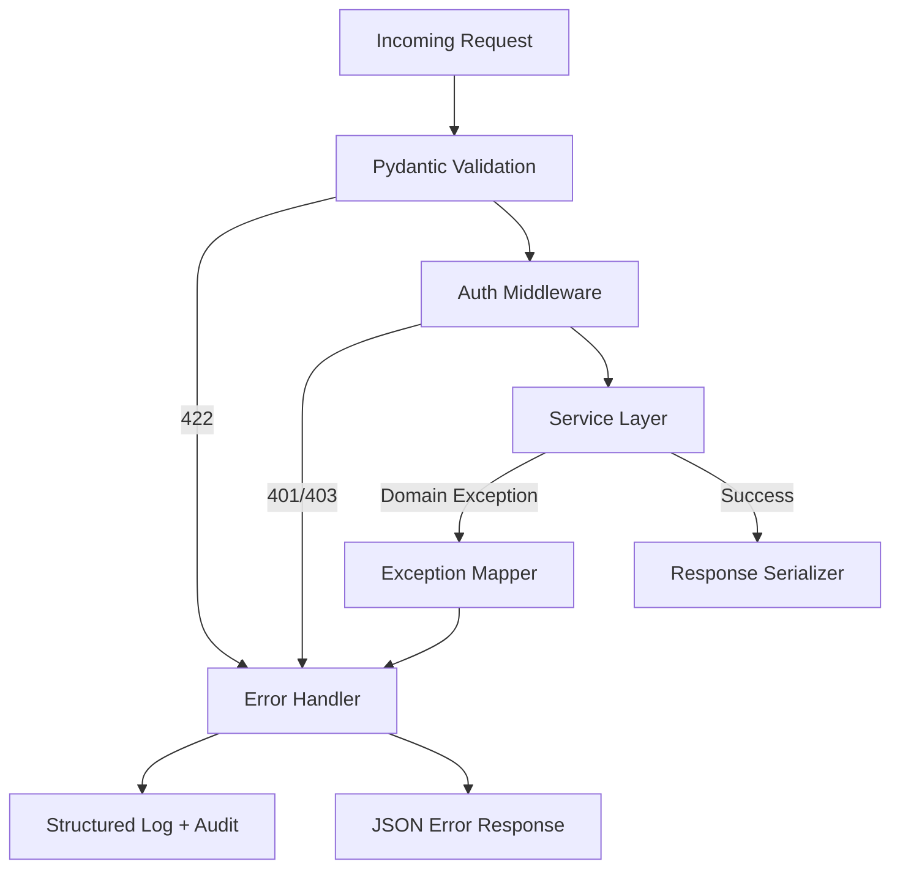

# API Design — Content Moderation Pipeline

## 1. Overview

REST API served by FastAPI under base path `/api/v1`. All request/response bodies are JSON. Timestamps are ISO 8601 UTC (`timestamptz`). UUIDs are string-encoded.

### 1.1 Global Conventions

| Convention | Value |
|------------|-------|
| Base URL | `/api/v1` |
| Content-Type | `application/json` |
| Authentication | `Authorization: Bearer <token>` or `X-API-Key: <platform_api_key>` |
| Idempotency | `Idempotency-Key: <uuid>` on mutating content/moderation endpoints |
| Correlation | `X-Request-Id: <uuid>` (generated if absent, echoed in response) |
| Pagination | Cursor-based: `?cursor=<opaque>&limit=20` (max 100) |
| Versioning | URL path versioning (`/api/v1`); breaking changes → `/api/v2` |

### 1.2 Role Access Matrix

| Endpoint Group | `platform_client` | `reviewer` | `senior_reviewer` | `admin` |
|----------------|:-----------------:|:----------:|:-----------------:|:-------:|
| Content submit/read | ✓ (own platform) | — | — | ✓ |
| Moderation status | ✓ | — | — | ✓ |
| Review queue | — | ✓ | ✓ | ✓ |
| Review actions | — | ✓ | ✓ | ✓ |
| Policies | — | — | — | ✓ |
| Routing rules | — | — | — | ✓ |
| Analytics | ✓ (own platform) | — | — | ✓ (all) |
| Audit logs | — | — | ✓ | ✓ |
| Platform admin | — | — | — | ✓ |

---

## 2. Standard Response Envelope

### 2.1 Success Response

```json
{
  "data": { },
  "meta": {
    "request_id": "550e8400-e29b-41d4-a716-446655440000",
    "timestamp": "2026-06-09T12:00:00Z"
  }
}
```

List endpoints wrap arrays in `data` and include pagination in `meta`:

```json
{
  "data": [ ],
  "meta": {
    "request_id": "...",
    "timestamp": "...",
    "pagination": {
      "next_cursor": "eyJpZCI6...",
      "has_more": true,
      "limit": 20
    }
  }
}
```

### 2.2 Error Response

```json
{
  "error": {
    "code": "CONTENT_NOT_FOUND",
    "message": "Content item not found",
    "details": [
      {
        "field": "content_id",
        "issue": "No record with this ID for your platform"
      }
    ],
    "request_id": "550e8400-e29b-41d4-a716-446655440000"
  }
}
```

---

## 3. Error Handling Strategy

### 3.1 HTTP Status Code Mapping

| Status | Usage |
|--------|-------|
| `200 OK` | Successful GET, PATCH, action endpoints |
| `201 Created` | Resource created (content, policy, review action) |
| `202 Accepted` | Async moderation job enqueued |
| `204 No Content` | Successful DELETE with no body |
| `400 Bad Request` | Validation failure, malformed JSON |
| `401 Unauthorized` | Missing or invalid credentials |
| `403 Forbidden` | Valid credentials, insufficient role or platform scope |
| `404 Not Found` | Resource does not exist or not visible to caller |
| `409 Conflict` | Idempotency conflict, optimistic lock failure, duplicate external_id |
| `422 Unprocessable Entity` | Semantic validation (Pydantic field errors) |
| `429 Too Many Requests` | Rate limit exceeded |
| `500 Internal Server Error` | Unhandled server error |
| `502 Bad Gateway` | Upstream Gemini failure on sync endpoint |
| `503 Service Unavailable` | Maintenance or circuit breaker open |

### 3.2 Error Code Catalog

| Code | HTTP | Description |
|------|------|-------------|
| `VALIDATION_ERROR` | 422 | Request schema validation failed |
| `INVALID_CURSOR` | 400 | Pagination cursor malformed or expired |
| `UNAUTHORIZED` | 401 | Authentication required |
| `FORBIDDEN` | 403 | Access denied |
| `CONTENT_NOT_FOUND` | 404 | Content ID not found |
| `JOB_NOT_FOUND` | 404 | Moderation job not found |
| `DECISION_NOT_FOUND` | 404 | Decision not found |
| `POLICY_NOT_FOUND` | 404 | Policy not found |
| `QUEUE_ITEM_NOT_FOUND` | 404 | Review queue item not found |
| `DUPLICATE_CONTENT` | 409 | external_id already exists |
| `IDEMPOTENCY_CONFLICT` | 409 | Same key, different payload |
| `OPTIMISTIC_LOCK_FAILURE` | 409 | Resource modified concurrently |
| `RATE_LIMIT_EXCEEDED` | 429 | Too many requests |
| `GEMINI_UNAVAILABLE` | 502 | AI provider error (sync only) |
| `PIPELINE_FAILED` | 500 | Moderation job failed |
| `INTERNAL_ERROR` | 500 | Unexpected error |

### 3.3 Exception Handling Layers



- **Never expose** stack traces or internal paths in production responses.
- **Always include** `request_id` in error responses for support correlation.
- **Log** full exception server-side with `request_id`, `platform_id`, `actor_id`.
- **Audit** security-relevant errors (`FORBIDDEN`, repeated `401`) at warning level.

### 3.4 Validation Strategy

| Layer | Responsibility |
|-------|----------------|
| Pydantic v2 request models | Field types, lengths, regex, cross-field validators |
| Service layer | Business rules (e.g., policy must be `draft` to edit) |
| Database | Check constraints, unique constraints (mapped to 409) |

---

## 4. REST Endpoints

### 4.1 Health and Meta

#### `GET /health`

Liveness probe. No authentication.

**Response `200`:**

```json
{
  "data": {
    "status": "healthy",
    "version": "1.0.0"
  },
  "meta": { "request_id": "...", "timestamp": "..." }
}
```

#### `GET /ready`

Readiness probe (DB + Redis connectivity).

**Response `200`:** `{ "data": { "status": "ready", "checks": { "postgres": "ok", "redis": "ok" } } }`

**Response `503`:** if dependency unhealthy.

---

### 4.2 Content

#### `POST /content`

Submit content for moderation (creates content + enqueues moderation job).

**Headers:** `Idempotency-Key` (recommended)

**Request:**

```json
{
  "external_id": "post-98765",
  "content_type": "text",
  "body_text": "User submitted text content",
  "media_urls": ["https://cdn.example.com/img/1.jpg"],
  "author_external_id": "user-12345",
  "locale": "en-US",
  "metadata": {
    "channel": "public_feed",
    "parent_external_id": "post-98700",
    "audience": "general"
  },
  "submitted_at": "2026-06-09T11:55:00Z",
  "sync": false
}
```

| Field | Type | Required | Constraints |
|-------|------|----------|-------------|
| `external_id` | string | yes | max 256 |
| `content_type` | enum | yes | `text`, `image`, `video`, `mixed` |
| `body_text` | string | conditional | required if `content_type` is `text` or `mixed`; max 50000 |
| `media_urls` | string[] | conditional | required if `image`/`video`/`mixed`; max 10 URLs |
| `author_external_id` | string | yes | max 256 |
| `locale` | string | no | BCP 47 |
| `metadata` | object | no | max 10 KB serialized |
| `submitted_at` | datetime | no | defaults to now |
| `sync` | boolean | no | default `false`; if `true`, waits for pipeline |

**Response `202` (async):**

```json
{
  "data": {
    "content_id": "a1b2c3d4-e5f6-7890-abcd-ef1234567890",
    "job_id": "b2c3d4e5-f6a7-8901-bcde-f12345678901",
    "status": "pending",
    "poll_url": "/api/v1/moderation/jobs/b2c3d4e5-f6a7-8901-bcde-f12345678901"
  },
  "meta": { "request_id": "...", "timestamp": "..." }
}
```

**Response `200` (sync):** Same `data` plus embedded `decision` object (see Decision schema).

---

#### `GET /content/{content_id}`

Retrieve content item with current status.

**Response `200`:**

```json
{
  "data": {
    "content_id": "a1b2c3d4-e5f6-7890-abcd-ef1234567890",
    "external_id": "post-98765",
    "platform_id": "...",
    "content_type": "text",
    "body_text": "User submitted text content",
    "media_urls": [],
    "author_external_id": "user-12345",
    "locale": "en-US",
    "metadata": { },
    "status": "under_review",
    "submitted_at": "2026-06-09T11:55:00Z",
    "created_at": "2026-06-09T11:55:01Z",
    "updated_at": "2026-06-09T11:56:00Z"
  },
  "meta": { }
}
```

---

#### `GET /content/{content_id}/versions`

List content version history.

**Query:** `cursor`, `limit`

**Response `200`:** Paginated list of version objects.

```json
{
  "data": [
    {
      "version_id": "...",
      "version_number": 2,
      "body_text": "...",
      "media_urls": [],
      "created_at": "..."
    }
  ],
  "meta": { "pagination": { } }
}
```

---

#### `POST /content/{content_id}/resubmit`

Submit edited content for re-moderation.

**Request:**

```json
{
  "body_text": "Updated text content",
  "media_urls": [],
  "metadata": { }
}
```

**Response `202`:** New `job_id` (same schema as `POST /content`).

---

### 4.3 Moderation

#### `GET /moderation/jobs/{job_id}`

Poll moderation job status.

**Response `200`:**

```json
{
  "data": {
    "job_id": "b2c3d4e5-f6a7-8901-bcde-f12345678901",
    "content_id": "a1b2c3d4-e5f6-7890-abcd-ef1234567890",
    "state": "classifying",
    "priority": 3,
    "attempt_count": 0,
    "error_message": null,
    "started_at": "2026-06-09T11:55:02Z",
    "completed_at": null,
    "created_at": "2026-06-09T11:55:01Z"
  },
  "meta": { }
}
```

**State values:** `pending`, `context_building`, `classifying`, `policy_evaluating`, `routing`, `completed`, `failed`

---

#### `GET /moderation/jobs/{job_id}/decision`

Retrieve decision for a completed job.

**Response `200`:** Decision object (see §5.3).

**Response `404`:** Job not completed or decision not yet available.

---

#### `GET /moderation/decisions/{decision_id}`

Retrieve a specific decision by ID.

**Response `200`:** Full Decision object with explanation.

---

#### `GET /content/{content_id}/decisions`

List all decisions for content (newest first).

**Query:** `cursor`, `limit`

**Response `200`:** Paginated Decision summary list.

---

### 4.4 Human Review

#### `GET /review/queue`

List human review queue items.

**Query parameters:**

| Param | Type | Description |
|-------|------|-------------|
| `status` | enum | `pending`, `assigned`, `in_progress`, `completed` |
| `priority` | int | Filter by priority 1–5 |
| `platform_id` | uuid | Admin only; reviewers see assigned platform |
| `category` | string | Filter by triggered category code |
| `sla_breached` | bool | Items past `sla_deadline` |
| `cursor`, `limit` | | Pagination |

**Response `200`:**

```json
{
  "data": [
    {
      "queue_item_id": "...",
      "content_id": "...",
      "decision_id": "...",
      "platform_id": "...",
      "queue_status": "pending",
      "priority": 2,
      "sla_deadline": "2026-06-09T13:00:00Z",
      "enqueued_at": "2026-06-09T12:00:00Z",
      "escalation_reason": null,
      "content_preview": {
        "content_type": "text",
        "body_text_truncated": "First 200 chars...",
        "author_external_id": "user-12345"
      },
      "ai_summary": {
        "max_confidence": 0.72,
        "top_categories": [
          { "code": "HARASSMENT", "confidence": 0.72 }
        ],
        "recommended_action": "human_review"
      }
    }
  ],
  "meta": { "pagination": { } }
}
```

---

#### `GET /review/queue/{queue_item_id}`

Full detail for a queue item including context and explanations.

**Response `200`:**

```json
{
  "data": {
    "queue_item_id": "...",
    "queue_status": "assigned",
    "priority": 2,
    "sla_deadline": "...",
    "content": { },
    "context_snapshot": {
      "thread_context": { },
      "author_history_summary": { },
      "platform_context": { }
    },
    "ai_decision": { },
    "explanation": { },
    "policy_violations": [ ],
    "active_assignment": {
      "assignment_id": "...",
      "reviewer_id": "...",
      "assigned_at": "..."
    }
  },
  "meta": { }
}
```

---

#### `POST /review/queue/{queue_item_id}/claim`

Reviewer self-assigns a pending item.

**Response `200`:**

```json
{
  "data": {
    "assignment_id": "...",
    "queue_item_id": "...",
    "reviewer_id": "...",
    "status": "active",
    "assigned_at": "..."
  },
  "meta": { }
}
```

**Response `409`:** Item already assigned.

---

#### `POST /review/queue/{queue_item_id}/assign`

Admin/senior reviewer manually assigns to a reviewer.

**Request:**

```json
{
  "reviewer_id": "reviewer-uuid"
}
```

**Response `200`:** Assignment object.

---

#### `POST /review/queue/{queue_item_id}/release`

Release an active assignment back to queue.

**Response `200`:** Updated queue item with `queue_status: pending`.

---

#### `POST /review/queue/{queue_item_id}/action`

Submit reviewer decision.

**Request:**

```json
{
  "action": "reject",
  "notes": "Clear harassment targeting a specific individual",
  "category_overrides": [
    { "code": "HARASSMENT", "severity": "high" }
  ]
}
```

| Field | Type | Required | Constraints |
|-------|------|----------|-------------|
| `action` | enum | yes | `approve`, `reject`, `escalate`, `request_edit` |
| `notes` | string | no | max 2000; required for `reject` and `escalate` |
| `category_overrides` | array | no | Valid category codes |

**Response `201`:**

```json
{
  "data": {
    "review_action_id": "...",
    "action": "reject",
    "override_ai": true,
    "human_decision_id": "...",
    "content_status": "rejected",
    "created_at": "..."
  },
  "meta": { }
}
```

---

#### `GET /review/metrics/me`

Reviewer personal metrics (current day + 7-day rolling).

**Response `200`:**

```json
{
  "data": {
    "today": {
      "items_reviewed": 42,
      "avg_handle_time_sec": 95,
      "agreement_with_ai_pct": 78.5
    },
    "rolling_7d": { }
  },
  "meta": { }
}
```

---

### 4.5 Policies (Admin)

#### `GET /policies`

List policies for platform.

**Query:** `status` (`draft`, `active`, `archived`), `cursor`, `limit`

**Response `200`:** Paginated policy summaries.

---

#### `POST /policies`

Create a new policy version (starts as `draft`).

**Request:**

```json
{
  "version_label": "v3.0",
  "description": "Q3 2026 community guidelines",
  "rules": [
    {
      "rule_type": "keyword_blocklist",
      "name": "Prohibited slurs",
      "condition": {
        "keywords": ["..."],
        "match_mode": "whole_word"
      },
      "action": "hard_block",
      "priority": 10,
      "is_active": true
    },
    {
      "rule_type": "ai_score_floor",
      "name": "Hate speech threshold",
      "condition": {
        "category_code": "HATE_SPEECH",
        "min_score": 0.70
      },
      "action": "violation",
      "priority": 20,
      "is_active": true
    }
  ]
}
```

**Response `201`:** Created policy with `id`, `status: draft`, embedded rules.

---

#### `GET /policies/{policy_id}`

Retrieve policy with all rules.

---

#### `PATCH /policies/{policy_id}`

Update draft policy (rules, description). Only `draft` policies editable.

---

#### `POST /policies/{policy_id}/publish`

Activate policy (archives previous active policy for same platform).

**Response `200`:** `{ "id": "...", "status": "active", "effective_from": "..." }`

---

#### `POST /policies/{policy_id}/simulate`

Dry-run policy against sample content (no persistence).

**Request:**

```json
{
  "body_text": "Sample content to test",
  "author_external_id": "user-test",
  "metadata": { },
  "mock_ai_scores": [
    { "category_code": "HATE_SPEECH", "confidence": 0.65 }
  ]
}
```

**Response `200`:**

```json
{
  "data": {
    "policy_verdict": "violation",
    "triggered_rules": [ ],
    "routing_recommendation": "human_review"
  },
  "meta": { }
}
```

---

### 4.6 Routing Rules (Admin)

#### `GET /routing/rules`

List routing rules.

**Query:** `platform_id`, `is_active`, `cursor`, `limit`

---

#### `POST /routing/rules`

Create a routing rule.

**Request:**

```json
{
  "platform_id": "platform-uuid",
  "category_code": "HATE_SPEECH",
  "min_confidence": 0.85,
  "max_confidence": 1.0,
  "policy_verdict_filter": "any",
  "routing_action": "auto_reject",
  "priority": 10,
  "is_active": true
}
```

**Response `201`:** Created rule object.

---

#### `PATCH /routing/rules/{rule_id}`

Update routing rule fields.

---

#### `DELETE /routing/rules/{rule_id}`

Soft-deactivate rule (`is_active: false`).

**Response `204`**

---

### 4.7 Categories (Admin)

#### `GET /categories`

List active moderation categories.

**Response `200`:**

```json
{
  "data": [
    {
      "id": "...",
      "code": "HATE_SPEECH",
      "display_name": "Hate Speech",
      "description": "...",
      "severity_default": "high",
      "is_active": true
    }
  ],
  "meta": { }
}
```

---

### 4.8 Analytics

#### `GET /analytics/summary`

Platform moderation summary.

**Query:** `start_date`, `end_date` (ISO date), `platform_id` (admin)

**Response `200`:**

```json
{
  "data": {
    "period": { "start": "2026-06-01", "end": "2026-06-09" },
    "totals": {
      "submitted": 15420,
      "completed": 15380,
      "auto_approved": 12100,
      "auto_rejected": 1890,
      "human_reviewed": 1390,
      "escalated": 120
    },
    "latency": {
      "avg_pipeline_ms": 1850,
      "p95_pipeline_ms": 4200
    },
    "quality": {
      "ai_override_rate_pct": 12.4
    },
    "cost": {
      "gemini_tokens_total": 4520000
    },
    "realtime": {
      "queue_depth": 23,
      "submissions_last_hour": 187
    }
  },
  "meta": { }
}
```

---

#### `GET /analytics/categories`

Per-category breakdown.

**Query:** `start_date`, `end_date`, `platform_id`

**Response `200`:**

```json
{
  "data": [
    {
      "category_code": "SPAM",
      "detection_count": 3200,
      "avg_confidence": 0.91,
      "auto_action_count": 2900,
      "human_override_count": 85
    }
  ],
  "meta": { }
}
```

---

#### `GET /analytics/reviewers`

Reviewer performance (admin/senior).

**Query:** `start_date`, `end_date`, `reviewer_id`

---

### 4.9 Audit

#### `GET /audit/logs`

Query audit trail.

**Query:**

| Param | Type | Description |
|-------|------|-------------|
| `entity_type` | string | e.g., `content_item` |
| `entity_id` | uuid | |
| `actor_type` | enum | `system`, `ai`, `reviewer`, `admin` |
| `action` | string | e.g., `moderation.completed` |
| `correlation_id` | uuid | |
| `start_time`, `end_time` | datetime | Range filter |
| `cursor`, `limit` | | Pagination |

**Response `200`:**

```json
{
  "data": [
    {
      "audit_id": "...",
      "correlation_id": "...",
      "actor_type": "system",
      "actor_id": null,
      "action": "moderation.completed",
      "entity_type": "content_item",
      "entity_id": "...",
      "before_state": { },
      "after_state": { },
      "metadata": { },
      "created_at": "..."
    }
  ],
  "meta": { "pagination": { } }
}
```

---

#### `GET /audit/content/{content_id}/timeline`

Chronological audit timeline for a content item (all related entities).

**Response `200`:** Ordered list of audit events with human-readable `summary` field added by service.

---

### 4.10 Platform Admin

#### `GET /platforms`

List platforms (admin only).

---

#### `POST /platforms`

Register a new platform.

**Request:**

```json
{
  "name": "Example Social",
  "slug": "example-social",
  "default_locale": "en-US",
  "data_retention_days": 365,
  "webhook_url": "https://api.example.com/moderation/callback",
  "settings": {
    "sync_moderation_enabled": false,
    "default_sla_hours": 4
  }
}
```

**Response `201`:** Platform object including one-time `api_key` field.

---

#### `PATCH /platforms/{platform_id}`

Update platform settings.

---

#### `POST /platforms/{platform_id}/rotate-api-key`

Rotate API key.

**Response `200`:** `{ "api_key": "new-key-shown-once" }`

---

### 4.11 Webhooks

#### `GET /webhooks/endpoints`

List webhook endpoints for platform.

---

#### `POST /webhooks/endpoints`

Register webhook endpoint.

**Request:**

```json
{
  "url": "https://api.example.com/hooks/moderation",
  "event_types": ["moderation.completed", "review.completed"],
  "secret": "whsec_..."
}
```

---

#### `DELETE /webhooks/endpoints/{endpoint_id}`

Deactivate endpoint. **Response `204`**

---

#### Webhook Payload (Outbound)

Platforms receive signed POST requests:

**Headers:** `X-Webhook-Signature: sha256=<hmac>`, `X-Request-Id`, `X-Event-Type`

```json
{
  "event_type": "moderation.completed",
  "timestamp": "2026-06-09T12:01:00Z",
  "data": {
    "content_id": "...",
    "external_id": "post-98765",
    "decision_id": "...",
    "final_action": "reject",
    "routing_action": "auto_reject",
    "category_scores": [ ],
    "explanation_summary": "..."
  }
}
```

---

## 5. Shared Schema Definitions

### 5.1 CategoryScore

```json
{
  "category_code": "HATE_SPEECH",
  "display_name": "Hate Speech",
  "confidence": 0.92,
  "severity": "high",
  "is_triggered": true
}
```

### 5.2 PolicyViolation

```json
{
  "rule_id": "...",
  "rule_name": "Prohibited slurs",
  "rule_type": "keyword_blocklist",
  "action": "hard_block",
  "violation_detail": {
    "matched_keyword": "[redacted]"
  }
}
```

### 5.3 Decision (Full)

```json
{
  "decision_id": "...",
  "content_id": "...",
  "job_id": "...",
  "decision_type": "routing",
  "final_action": "reject",
  "overall_risk_score": 0.88,
  "routing": {
    "routing_action": "auto_reject",
    "matched_rule_id": "...",
    "max_confidence": 0.92,
    "reasoning_trace": [ ]
  },
  "category_scores": [ ],
  "policy_verdict": "violation",
  "policy_violations": [ ],
  "explanation": {
    "ai_rationale": [
      {
        "category_code": "HATE_SPEECH",
        "rationale": "Content contains targeted slurs directed at a protected group."
      }
    ],
    "context_factors": ["author_repeat_offender"],
    "policy_explanation": "Matched hard-block rule: Prohibited slurs",
    "model_version": "gemini-2.0-flash",
    "prompt_template_version": "v1.3"
  },
  "policy_version_id": "...",
  "is_current": true,
  "decided_by": "system",
  "created_at": "2026-06-09T12:01:00Z"
}
```

### 5.4 ExplanationSummary (Abbreviated for lists)

```json
{
  "top_category": "HARASSMENT",
  "max_confidence": 0.72,
  "rationale_preview": "First 150 characters of primary rationale...",
  "context_factors_count": 2
}
```

---

## 6. Rate Limits

| Caller | Limit | Window |
|--------|-------|--------|
| `platform_client` | 1000 requests | per minute |
| `POST /content` | 200 submissions | per minute per platform |
| `reviewer` | 300 requests | per minute |
| `admin` | 500 requests | per minute |

**Response `429` headers:** `Retry-After: <seconds>`, `X-RateLimit-Remaining: 0`

---

## 7. API Endpoint Summary

| # | Method | Path | Description |
|---|--------|------|-------------|
| 1 | GET | `/health` | Liveness |
| 2 | GET | `/ready` | Readiness |
| 3 | POST | `/content` | Submit content |
| 4 | GET | `/content/{content_id}` | Get content |
| 5 | GET | `/content/{content_id}/versions` | Version history |
| 6 | POST | `/content/{content_id}/resubmit` | Re-moderate |
| 7 | GET | `/moderation/jobs/{job_id}` | Job status |
| 8 | GET | `/moderation/jobs/{job_id}/decision` | Job decision |
| 9 | GET | `/moderation/decisions/{decision_id}` | Get decision |
| 10 | GET | `/content/{content_id}/decisions` | Decision history |
| 11 | GET | `/review/queue` | List queue |
| 12 | GET | `/review/queue/{queue_item_id}` | Queue detail |
| 13 | POST | `/review/queue/{queue_item_id}/claim` | Claim item |
| 14 | POST | `/review/queue/{queue_item_id}/assign` | Assign item |
| 15 | POST | `/review/queue/{queue_item_id}/release` | Release item |
| 16 | POST | `/review/queue/{queue_item_id}/action` | Reviewer action |
| 17 | GET | `/review/metrics/me` | Reviewer metrics |
| 18 | GET | `/policies` | List policies |
| 19 | POST | `/policies` | Create policy |
| 20 | GET | `/policies/{policy_id}` | Get policy |
| 21 | PATCH | `/policies/{policy_id}` | Update draft |
| 22 | POST | `/policies/{policy_id}/publish` | Publish policy |
| 23 | POST | `/policies/{policy_id}/simulate` | Simulate policy |
| 24 | GET | `/routing/rules` | List routing rules |
| 25 | POST | `/routing/rules` | Create rule |
| 26 | PATCH | `/routing/rules/{rule_id}` | Update rule |
| 27 | DELETE | `/routing/rules/{rule_id}` | Deactivate rule |
| 28 | GET | `/categories` | List categories |
| 29 | GET | `/analytics/summary` | Analytics summary |
| 30 | GET | `/analytics/categories` | Category analytics |
| 31 | GET | `/analytics/reviewers` | Reviewer analytics |
| 32 | GET | `/audit/logs` | Query audit logs |
| 33 | GET | `/audit/content/{content_id}/timeline` | Content timeline |
| 34 | GET | `/platforms` | List platforms |
| 35 | POST | `/platforms` | Create platform |
| 36 | PATCH | `/platforms/{platform_id}` | Update platform |
| 37 | POST | `/platforms/{platform_id}/rotate-api-key` | Rotate key |
| 38 | GET | `/webhooks/endpoints` | List webhooks |
| 39 | POST | `/webhooks/endpoints` | Create webhook |
| 40 | DELETE | `/webhooks/endpoints/{endpoint_id}` | Delete webhook |

**Total: 40 REST endpoints**

---

## 8. Potential Risks and Improvements

### 8.1 Risks

| Risk | Impact |
|------|--------|
| **Sync endpoint abuse** | Platforms enabling `sync=true` can cause API timeouts and cascade failures |
| **Large payload submissions** | Oversized `body_text` or `metadata` without strict limits causes memory pressure |
| **Webhook replay attacks** | Without timestamp tolerance in HMAC verification, payloads could be replayed |
| **Cursor forgery** | Opaque cursors must be signed to prevent enumeration |
| **Over-fetching on queue list** | Returning AI summaries for large queues is expensive |
| **Inconsistent error shapes** | Third-party Gemini errors leaking into responses if not normalized |

### 8.2 Improvements

| Area | Recommendation |
|------|----------------|
| **API** | Add GraphQL or gRPC for reviewer dashboard batch queries |
| **Versioning** | Sunset headers on deprecated fields |
| **Documentation** | OpenAPI 3.1 spec auto-generated from FastAPI + Pydantic models |
| **Bulk API** | `POST /content/batch` for high-throughput platforms |
| **Streaming** | SSE endpoint for job status instead of polling |
| **Field filtering** | `?fields=` sparse fieldsets on content/decision responses |
| **Webhooks** | Exponential backoff retry with dead-letter; webhook test endpoint |
| **Security** | mTLS for enterprise platforms; IP allowlisting per platform |
