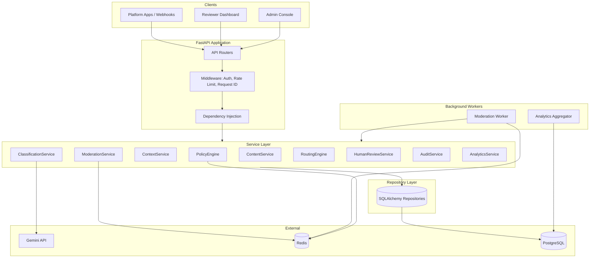
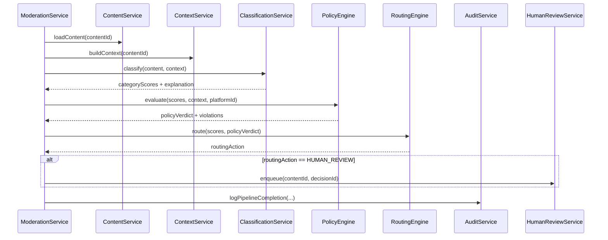
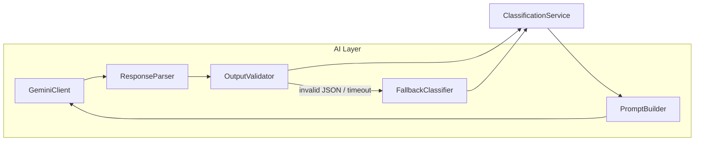
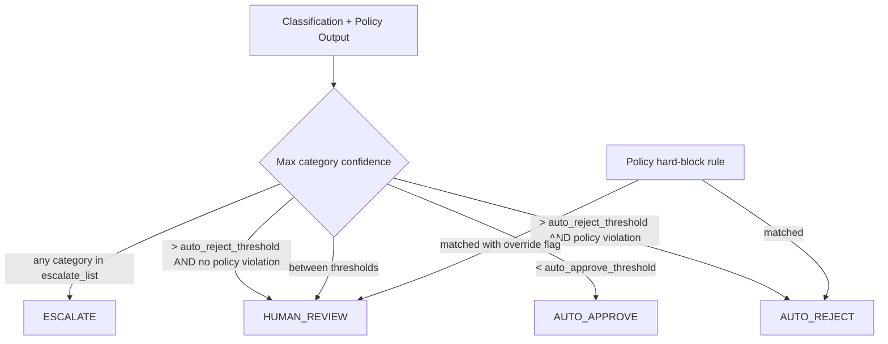
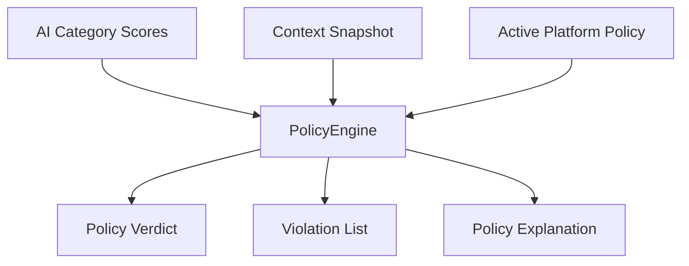
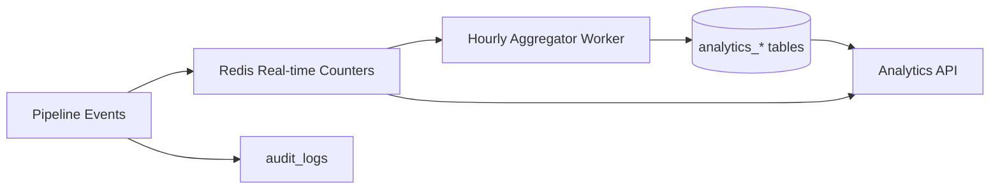

# AI-Powered Content Moderation Pipeline — System Architecture

## 1. Overview

This document defines the backend architecture for a multi-tenant, platform-aware content moderation system. The pipeline ingests user-generated content, enriches it with contextual signals, classifies it across multiple harm categories via Gemini, applies platform-specific policies, routes outcomes by confidence thresholds, and surfaces low-confidence or policy-conflict cases to a human review queue. Every decision is explainable and fully auditable.

### Design Principles

| Principle | Application |
|-----------|-------------|
| **Separation of concerns** | API, services, repositories, AI, routing, and policy are isolated layers with explicit contracts |
| **Fail-safe defaults** | Ambiguous or errored AI output routes to human review, never auto-approve |
| **Immutability of decisions** | Decisions are append-only; corrections create new decision records |
| **Policy as data** | Platform rules are versioned configuration, not hard-coded logic |
| **Observability by design** | Structured logs, audit events, and analytics hooks at every stage transition |

### Technology Stack

| Layer | Technology |
|-------|------------|
| API | FastAPI |
| ORM | SQLAlchemy 2.0 (async) |
| Migrations | Alembic |
| Primary store | PostgreSQL 15+ |
| Cache / queue | Redis (job queue, rate limiting, hot policy cache) |
| Validation | Pydantic v2 |
| AI provider | Google Gemini API |

---

## 2. System Architecture

### 2.1 High-Level Component Diagram



### 2.2 Request Lifecycle (Synchronous vs Asynchronous)

| Path | Trigger | Flow |
|------|---------|------|
| **Async (default)** | `POST /moderation/submit` | Persist content → enqueue job → return `202` with `job_id` → worker executes full pipeline → client polls or receives webhook |
| **Sync (optional)** | `POST /moderation/submit?sync=true` | Same pipeline inline; bounded by timeout; intended for low-latency platforms only |

The default async path protects API availability under Gemini latency spikes and enables horizontal worker scaling.

### 2.3 Deployment Topology

```
┌─────────────────────────────────────────────────────────────┐
│  Load Balancer                                              │
└──────────────┬──────────────────────────────────────────────┘
               │
    ┌──────────┴──────────┐
    │  FastAPI Instances  │  (stateless, N replicas)
    └──────────┬──────────┘
               │
    ┌──────────┴──────────┐     ┌─────────────┐
    │  Worker Instances   │────▶│   Redis     │
    └──────────┬──────────┘     │  (queue +   │
               │                │   cache)    │
    ┌──────────┴──────────┐     └─────────────┘
    │   PostgreSQL        │
    │   (primary +        │
    │    read replica)    │
    └─────────────────────┘
```

- **FastAPI instances**: Handle HTTP, enqueue work, serve read APIs.
- **Worker instances**: Consume moderation jobs from Redis; run context build → classify → policy → route.
- **PostgreSQL read replica**: Analytics queries and audit log reads to offload primary.

### 2.4 Cross-Cutting Concerns

| Concern | Implementation |
|---------|----------------|
| **Authentication** | API keys per platform (service-to-service); JWT for reviewer/admin UIs |
| **Authorization** | RBAC: `platform_client`, `reviewer`, `senior_reviewer`, `admin` |
| **Idempotency** | `Idempotency-Key` header on submit endpoints; deduplicate by `(platform_id, idempotency_key)` |
| **Correlation** | `X-Request-Id` propagated through services, workers, audit logs, and Gemini metadata |
| **Rate limiting** | Per-platform token bucket in Redis |
| **Secrets** | Gemini API key via environment / secret manager; never stored in DB |

---

## 3. Service Layer Design

Services encapsulate business logic and orchestrate repositories and external integrations. They do not perform raw SQL or HTTP calls directly (delegated to repositories and AI client).

### 3.1 Service Inventory

| Service | Responsibility | Key Dependencies |
|---------|----------------|------------------|
| **ContentService** | Ingest, validate, version, and retrieve content artifacts | `ContentRepository`, `ContentVersionRepository` |
| **ContextService** | Assemble moderation context (thread, author history, metadata, locale) | `ContextRepository`, `ContentRepository`, `AuthorHistoryRepository` |
| **ModerationService** | Orchestrate end-to-end pipeline; manage job state machine | All pipeline services, `ModerationJobRepository` |
| **ClassificationService** | Invoke Gemini; parse multi-category scores; attach explanations | `GeminiClient`, `CategoryRepository`, `ExplanationRepository` |
| **PolicyEngine** | Evaluate platform policies against classification output + context | `PolicyRepository`, `PolicyRuleEvaluator` |
| **RoutingEngine** | Map confidence + policy outcome to routing action | `RoutingRuleRepository`, `RoutingDecisionRepository` |
| **HumanReviewService** | Queue management, assignment, SLA tracking, reviewer actions | `ReviewQueueRepository`, `ReviewAssignmentRepository` |
| **AuditService** | Append immutable audit events; support filtered queries | `AuditLogRepository` |
| **AnalyticsService** | Real-time counters + batch aggregates; dashboard metrics | `AnalyticsRepository`, Redis counters |
| **PlatformService** | Platform CRUD, API key rotation, policy binding | `PlatformRepository` |
| **WebhookService** | Deliver decision callbacks to platform endpoints | `WebhookRepository`, HTTP client |

### 3.2 Service Interaction (Moderation Orchestration)



### 3.3 Moderation Job State Machine

```
PENDING → CONTEXT_BUILDING → CLASSIFYING → POLICY_EVALUATING → ROUTING → COMPLETED
                │                │               │                │
                └────────────────┴───────────────┴────────────────┘
                                    │
                              FAILED (retryable / dead-letter)
```

| State | Timeout | On Failure |
|-------|---------|------------|
| `CONTEXT_BUILDING` | 30s | Retry up to 3×; then `FAILED` |
| `CLASSIFYING` | 60s | Retry with backoff; Gemini errors logged |
| `POLICY_EVALUATING` | 10s | Non-retryable config errors → `FAILED` |
| `ROUTING` | 5s | Default to `HUMAN_REVIEW` on error |

### 3.4 Service Contracts (Conceptual)

Each service exposes async methods returning Pydantic domain models (not ORM entities) to keep layers decoupled:

- **Input DTOs**: Validated at API boundary; passed unchanged to services.
- **Output DTOs**: Services return domain objects; API layer maps to response schemas.
- **Errors**: Services raise domain exceptions (`ContentNotFound`, `PolicyEvaluationError`); API layer maps to HTTP status codes.

---

## 4. Repository Layer Design

Repositories abstract PostgreSQL access via SQLAlchemy 2.0 async sessions. One repository per aggregate root; no business logic inside repositories.

### 4.1 Repository Inventory

| Repository | Aggregate / Entity Group | Primary Operations |
|------------|--------------------------|-------------------|
| `PlatformRepository` | `platforms` | CRUD, find by API key hash |
| `ContentRepository` | `content_items` | Create, find by ID/platform, soft-delete |
| `ContentVersionRepository` | `content_versions` | Append version, list by content |
| `ContextRepository` | `content_context_snapshots` | Persist snapshot, find latest by content |
| `AuthorHistoryRepository` | `author_moderation_history` | Upsert stats, fetch rolling window |
| `ModerationJobRepository` | `moderation_jobs` | Create, update state, find pending |
| `ModerationDecisionRepository` | `moderation_decisions` | Append decision, find latest, list history |
| `CategoryRepository` | `moderation_categories` | List active taxonomy |
| `DecisionCategoryScoreRepository` | `decision_category_scores` | Bulk insert scores per decision |
| `PolicyRepository` | `platform_policies`, `policy_rules` | Load active policy version, list rules |
| `RoutingRuleRepository` | `routing_rules` | Load rules by platform + category |
| `RoutingDecisionRepository` | `routing_decisions` | Persist routing outcome |
| `ReviewQueueRepository` | `human_review_queue` | Enqueue, dequeue, list filtered |
| `ReviewAssignmentRepository` | `review_assignments` | Assign, release, find by reviewer |
| `ReviewActionRepository` | `review_actions` | Record reviewer decision |
| `ExplanationRepository` | `explanation_records` | Store AI + policy explanations |
| `AuditLogRepository` | `audit_logs` | Append-only insert, paginated query |
| `AnalyticsRepository` | `analytics_daily_aggregates`, `analytics_category_metrics` | Upsert aggregates, range queries |
| `WebhookRepository` | `webhook_deliveries` | Track delivery attempts |

### 4.2 Repository Patterns

| Pattern | Usage |
|---------|-------|
| **Unit of Work** | FastAPI dependency yields `AsyncSession`; services commit via `session.commit()` at orchestration boundaries |
| **Specification queries** | Complex filters (review queue) built as composable SQLAlchemy expressions in dedicated query builders |
| **Optimistic locking** | `version` column on `moderation_jobs` and `human_review_queue` rows to prevent lost updates |
| **Bulk operations** | `decision_category_scores` inserted in single statement per decision |
| **Read/write splitting** | Analytics and audit list endpoints optionally bind to read-replica session |

### 4.3 Caching Strategy (Redis)

| Key Pattern | TTL | Invalidation |
|-------------|-----|--------------|
| `policy:{platform_id}:active` | 5 min | On policy publish event |
| `routing_rules:{platform_id}` | 5 min | On routing rule update |
| `categories:active` | 1 hour | On taxonomy change |
| `analytics:realtime:{platform_id}:{metric}` | — | Counter increment; flushed to PG hourly |

Repositories remain the source of truth; cache is a performance layer accessed by PolicyEngine and RoutingEngine via a thin `CachePort` abstraction.

---

## 5. AI Layer Design

### 5.1 Architecture



### 5.2 GeminiClient Responsibilities

- Manage API authentication, model selection (`gemini-2.0-flash` for latency; `gemini-2.0-pro` for escalation).
- Apply request-level timeout and circuit breaker (open after N consecutive failures).
- Attach `request_id` and `content_id` as logging metadata (not sent as PII to model unless required).
- Track token usage per call for analytics and cost attribution.

### 5.3 PromptBuilder — Context-Aware Classification

The prompt is assembled from structured sections:

1. **System instruction**: Role, output JSON schema, category definitions.
2. **Platform policy summary**: Condensed active rules (not full legal text) to bias classification.
3. **Content payload**: Text body, media descriptions (pre-processed), content type.
4. **Context block**: Thread excerpt, author violation count (last 90 days), content locale, audience rating.
5. **Few-shot examples**: Platform-specific examples loaded from `policy_rules.example_payload` (optional).

Output schema (enforced by `OutputValidator`):

```json
{
  "categories": [
    {
      "category_code": "HATE_SPEECH",
      "confidence": 0.92,
      "severity": "high",
      "rationale": "..."
    }
  ],
  "overall_risk_score": 0.88,
  "context_factors": ["author_repeat_offender", "thread_escalation"],
  "recommended_action": "reject"
}
```

### 5.4 ResponseParser and OutputValidator

- Parse JSON; reject markdown fences or truncated responses.
- Validate confidence ∈ [0, 1], category codes against active taxonomy.
- Clamp or flag out-of-distribution scores.
- On validation failure: invoke `FallbackClassifier` → returns `confidence = 0.0` for all categories → forces human review path.

### 5.5 Explainability Artifacts

`ClassificationService` persists:

| Field | Source |
|-------|--------|
| `ai_rationale` | Per-category `rationale` from Gemini |
| `context_factors` | Model-identified context influences |
| `prompt_hash` | SHA-256 of prompt template + version (not raw content) |
| `model_version` | Gemini model ID |
| `raw_response_ref` | Optional encrypted blob reference for dispute resolution |

Explanations are stored in `explanation_records` and linked to `moderation_decisions`; never overwritten.

### 5.6 Safety and PII

- Redact emails, phone numbers, and payment data from prompts via pre-processing step in `ContextService`.
- Log prompt token counts, not prompt content, in application logs.
- Support `data_retention_days` per platform for raw AI response storage.

---

## 6. Routing Engine Design

The Routing Engine translates classification confidence scores and policy verdicts into a concrete action. It is deterministic and fully configurable per platform.

### 6.1 Routing Actions

| Action | Meaning |
|--------|---------|
| `AUTO_APPROVE` | Content published without human touch |
| `AUTO_REJECT` | Content blocked automatically |
| `HUMAN_REVIEW` | Enqueued for manual review |
| `ESCALATE` | Priority human review (senior reviewer, SLA < 1h) |
| `SHADOW_APPROVE` | Approved but flagged for post-hoc audit sampling |

### 6.2 Decision Matrix (Conceptual)



### 6.3 Routing Rule Configuration

Rules are stored in `routing_rules` and evaluated in priority order:

| Rule Attribute | Description |
|----------------|-------------|
| `platform_id` | Scope (null = global default) |
| `category_code` | Specific category or `*` |
| `min_confidence` / `max_confidence` | Confidence band |
| `policy_verdict` | `violation`, `clean`, `any` |
| `action` | Target routing action |
| `priority` | Lower number = higher precedence |

### 6.4 Routing Engine Algorithm

1. Load active routing rules for platform (cached).
2. Compute `max_confidence` across all category scores.
3. Identify `triggered_categories` where confidence ≥ category-specific threshold.
4. If PolicyEngine returned `hard_block` → `AUTO_REJECT` (unless rule says escalate).
5. Evaluate rules by priority; first match wins.
6. If no rule matches → default `HUMAN_REVIEW` (fail-safe).
7. Persist `routing_decisions` with matched rule ID and reasoning trace.

### 6.5 Confidence Calibration

- Routing thresholds are per-platform and per-category (e.g., hate speech threshold 0.85, spam threshold 0.95).
- Analytics feedback loop: weekly review of false positive/negative rates informs threshold adjustments (manual admin action, not auto-tuned in v1).

---

## 7. Policy Engine Design

The Policy Engine layers **deterministic, platform-specific rules** on top of probabilistic AI output.

### 7.1 Policy Architecture



### 7.2 Policy Components

| Component | Description |
|-----------|-------------|
| **Platform Policy** | Versioned document bound to `platform_id`; status: `draft`, `active`, `archived` |
| **Policy Rules** | Atomic rules with type, condition, and action |
| **Rule Types** | `keyword_blocklist`, `regex_pattern`, `category_threshold`, `author_strike`, `geo_restriction`, `content_type_restriction`, `ai_score_floor` |

### 7.3 Rule Evaluation Order

1. **Hard-block rules** (keyword, regex) — immediate violation if matched.
2. **Author strike rules** — e.g., 3 prior rejections → auto-escalate.
3. **AI score floor rules** — e.g., `HATE_SPEECH confidence > 0.7` → violation regardless of routing thresholds.
4. **Geo / content-type restrictions** — context-based gates.
5. **Soft rules** — add flags but do not alone cause rejection.

### 7.4 Policy Verdict Model

| Verdict | Description |
|---------|-------------|
| `clean` | No rules triggered |
| `soft_flag` | Informational flags for reviewers |
| `violation` | Policy breached; feeds routing engine |
| `hard_block` | Mandatory rejection regardless of AI confidence |

### 7.5 Policy Versioning

- Only one `active` policy per platform at a time.
- Decisions store `policy_version_id` for reproducibility.
- Policy changes do not retroactively alter past decisions.

### 7.6 Platform-Specific Moderation Policies (Examples)

| Platform Profile | Policy Emphasis |
|------------------|-----------------|
| **Social feed** | Hate speech, harassment, misinformation; lenient on profanity |
| **Kids app** | Strict profanity, contact-sharing, grooming indicators; low auto-approve thresholds |
| **Marketplace** | Spam, scams, prohibited goods; keyword blocklists |
| **Forum** | Thread-context escalation; repeat-offender amplification |

---

## 8. Analytics Design

### 8.1 Analytics Goals

- Operational visibility: throughput, latency, queue depth, reviewer SLA.
- Quality metrics: auto vs human override rates, category distribution, false positive signals.
- Cost tracking: Gemini token usage per platform.

### 8.2 Data Flow



### 8.3 Event Types (Emitted by Services)

| Event | Payload Highlights |
|-------|-------------------|
| `moderation.submitted` | platform_id, content_type |
| `moderation.completed` | decision_id, routing_action, duration_ms |
| `classification.completed` | category scores, model_version, token_count |
| `review.enqueued` | queue_priority, sla_deadline |
| `review.completed` | reviewer_id, action, override_of_ai |
| `policy.violation` | rule_id, policy_version_id |

### 8.4 Aggregate Tables

| Table | Granularity | Metrics |
|-------|-------------|---------|
| `analytics_daily_aggregates` | platform + day | total_submitted, auto_approved, auto_rejected, human_reviewed, avg_latency_ms, gemini_tokens |
| `analytics_category_metrics` | platform + day + category | count, avg_confidence, override_rate |
| `analytics_reviewer_metrics` | reviewer + day | items_reviewed, avg_handle_time_sec, agreement_with_ai |

### 8.5 Real-Time vs Batch

| Metric | Source | Freshness |
|--------|--------|-----------|
| Queue depth | Redis `LLEN review_queue:{platform}` | Real-time |
| Submissions/hour | Redis counter | Real-time |
| Override rate (7d) | PostgreSQL aggregate | Batch (hourly) |
| Category heatmap | PostgreSQL aggregate | Batch (daily) |

### 8.6 Dashboard API Surfaces

AnalyticsService exposes summary endpoints (see `api_design.md`) with date-range filters, platform scoping, and optional category breakdown. Admin role required for cross-platform aggregates.

---

## 9. Human Review Queue (Architectural Summary)

While detailed workflows live in `moderation_flow.md`, the architecture allocates:

- **Priority queue** in PostgreSQL (`human_review_queue`) backed by Redis sorted set for fast dequeue.
- **Assignment modes**: round-robin, skill-based (category expertise), manual claim.
- **SLA fields**: `enqueued_at`, `sla_deadline`, `priority` (1–5).
- **Reviewer actions** create a new `moderation_decisions` record (type `human_override`) and trigger webhook + audit event.

---

## 10. Auditability (Architectural Summary)

- **Append-only** `audit_logs` table; no UPDATE/DELETE grants on application DB role.
- Every state transition in the moderation job state machine emits an audit event.
- Audit records include: `actor_type` (system | ai | reviewer | admin), `actor_id`, `action`, `entity_type`, `entity_id`, `before_state`, `after_state`, `metadata`, `correlation_id`, `timestamp`.
- Separate DB role for audit read-only analytics queries.

---

## 11. Potential Risks and Improvements

### 11.1 Risks

| Risk | Impact | Likelihood |
|------|--------|------------|
| **Gemini API latency / outage** | Pipeline backlog, missed SLAs | Medium |
| **Non-deterministic AI output** | Inconsistent decisions for identical content | Medium |
| **Prompt injection via user content** | Model manipulation, incorrect classifications | Medium |
| **Policy rule explosion** | Evaluation latency, conflicting rules | Low–Medium |
| **Reviewer queue saturation** | SLA breaches during traffic spikes | Medium |
| **PII in AI prompts** | Compliance exposure (GDPR, etc.) | Medium |
| **Threshold misconfiguration** | Mass false positives or negatives | Low |
| **Single-region deployment** | No DR during regional outage | Low |

### 11.2 Improvements (Future Iterations)

| Area | Improvement |
|------|-------------|
| **Resilience** | Multi-model fallback (secondary LLM); dead-letter queue with alerting |
| **AI quality** | Human-labeled feedback loop; periodic eval harness with golden dataset |
| **Calibration** | Platt scaling or isotonic regression on confidence scores per category |
| **Performance** | Content-hash cache for duplicate classification; batch Gemini requests |
| **Policy** | Visual policy editor; simulation mode against historical content |
| **Review** | ML-assisted reviewer prioritization; collaborative review for edge cases |
| **Compliance** | Data residency per platform; automated retention purge jobs |
| **Security** | Content encryption at rest; field-level encryption for sensitive metadata |
| **Scale** | Event-driven architecture (Kafka/NATS) replacing Redis queue at high volume |
| **Testing** | Shadow mode: run new policy versions in parallel without affecting routing |

---

## 12. Document References

| Document | Contents |
|----------|----------|
| `database_design.md` | ERD, tables, indexes, constraints |
| `api_design.md` | REST endpoints, schemas, errors |
| `moderation_flow.md` | Step-by-step workflows |
