# Database Design — Content Moderation Pipeline

## 1. Overview

PostgreSQL 15+ is the system of record. All tables use UUID primary keys (`gen_random_uuid()`), `timestamptz` for temporal columns, and soft-delete only where explicitly noted. The schema supports multi-tenancy via `platform_id` foreign keys.

### Naming Conventions

| Element | Convention |
|---------|------------|
| Tables | `snake_case`, plural nouns |
| Primary keys | `id` (UUID) |
| Foreign keys | `{referenced_table_singular}_id` |
| Timestamps | `created_at`, `updated_at` |
| Enums | PostgreSQL `ENUM` types or `VARCHAR` with check constraints |

---

## 2. Entity-Relationship Diagram

```mermaid
erDiagram
    platforms ||--o{ content_items : hosts
    platforms ||--o{ platform_policies : defines
    platforms ||--o{ routing_rules : configures
    platforms ||--o{ webhook_endpoints : registers

    content_items ||--o{ content_versions : versions
    content_items ||--o{ content_context_snapshots : contextualizes
    content_items ||--o{ moderation_jobs : processes
    content_items ||--o{ moderation_decisions : decides

    moderation_jobs ||--o| moderation_decisions : produces
    moderation_decisions ||--o{ decision_category_scores : scores
    moderation_decisions ||--o| routing_decisions : routes
    moderation_decisions ||--o| explanation_records : explains

    moderation_categories ||--o{ decision_category_scores : categorizes
    moderation_categories ||--o{ routing_rules : targets

    platform_policies ||--o{ policy_rules : contains
    platform_policies ||--o{ moderation_decisions : governs

    policy_rules ||--o{ policy_violations : triggers

    moderation_decisions ||--o{ policy_violations : records
    moderation_decisions ||--o| human_review_queue : enqueues
  human_review_queue ||--o{ review_assignments : assigns
    review_assignments ||--o| review_actions : resolves

    reviewers ||--o{ review_assignments : handles
    reviewers ||--o{ review_actions : performs

    content_items ||--o{ author_moderation_history : tracks
    platforms ||--o{ audit_logs : scopes
    platforms ||--o{ analytics_daily_aggregates : measures
    platforms ||--o{ analytics_category_metrics : measures

    moderation_decisions ||--o{ webhook_deliveries : notifies
```

---

## 3. Table Descriptions

### 3.1 Core Tenancy

#### `platforms`

Registered platform tenants (social app, marketplace, forum, etc.).

| Column | Type | Description |
|--------|------|-------------|
| `id` | UUID PK | Platform identifier |
| `name` | VARCHAR(128) | Display name |
| `slug` | VARCHAR(64) UNIQUE | URL-safe identifier |
| `api_key_hash` | VARCHAR(128) | bcrypt hash of API key |
| `status` | VARCHAR(20) | `active`, `suspended`, `archived` |
| `data_retention_days` | INTEGER | Content/AI artifact retention |
| `default_locale` | VARCHAR(10) | e.g., `en-US` |
| `webhook_url` | TEXT NULL | Default decision callback URL |
| `settings_json` | JSONB | Platform-specific config flags |
| `created_at` | TIMESTAMPTZ | |
| `updated_at` | TIMESTAMPTZ | |

---

### 3.2 Content Domain

#### `content_items`

Canonical content submitted for moderation.

| Column | Type | Description |
|--------|------|-------------|
| `id` | UUID PK | |
| `platform_id` | UUID FK → platforms | Tenant scope |
| `external_id` | VARCHAR(256) | Platform's own content ID |
| `content_type` | VARCHAR(32) | `text`, `image`, `video`, `mixed` |
| `body_text` | TEXT NULL | Primary text payload |
| `media_urls` | JSONB NULL | Array of media references |
| `author_external_id` | VARCHAR(256) | Platform's author/user ID |
| `locale` | VARCHAR(10) NULL | Content locale |
| `metadata_json` | JSONB NULL | Arbitrary platform metadata |
| `content_hash` | VARCHAR(64) | SHA-256 of normalized body (dedup) |
| `status` | VARCHAR(20) | `pending`, `approved`, `rejected`, `under_review` |
| `idempotency_key` | VARCHAR(128) NULL | Dedup key from client |
| `submitted_at` | TIMESTAMPTZ | Client submission time |
| `created_at` | TIMESTAMPTZ | |
| `updated_at` | TIMESTAMPTZ | |

#### `content_versions`

Immutable history when content is edited and re-submitted.

| Column | Type | Description |
|--------|------|-------------|
| `id` | UUID PK | |
| `content_id` | UUID FK → content_items | |
| `version_number` | INTEGER | Monotonic per content |
| `body_text` | TEXT NULL | Snapshot at version |
| `media_urls` | JSONB NULL | |
| `metadata_json` | JSONB NULL | |
| `created_at` | TIMESTAMPTZ | |

#### `content_context_snapshots`

Point-in-time context assembled for a moderation job.

| Column | Type | Description |
|--------|------|-------------|
| `id` | UUID PK | |
| `content_id` | UUID FK → content_items | |
| `moderation_job_id` | UUID FK → moderation_jobs | |
| `thread_context` | JSONB NULL | Parent/reply chain excerpt |
| `author_history_summary` | JSONB | Violation counts, account age, etc. |
| `platform_context` | JSONB | Geo, channel, audience rating |
| `locale_signals` | JSONB NULL | Detected language, region |
| `redaction_applied` | BOOLEAN | Whether PII was redacted |
| `created_at` | TIMESTAMPTZ | |

#### `author_moderation_history`

Rolling author statistics per platform (denormalized for fast context build).

| Column | Type | Description |
|--------|------|-------------|
| `id` | UUID PK | |
| `platform_id` | UUID FK → platforms | |
| `author_external_id` | VARCHAR(256) | |
| `total_submissions` | INTEGER | |
| `total_rejections` | INTEGER | |
| `total_escalations` | INTEGER | |
| `last_violation_at` | TIMESTAMPTZ NULL | |
| `strike_count` | INTEGER | Active strikes |
| `updated_at` | TIMESTAMPTZ | |

---

### 3.3 Moderation Pipeline

#### `moderation_jobs`

Async pipeline execution tracker.

| Column | Type | Description |
|--------|------|-------------|
| `id` | UUID PK | Public `job_id` |
| `content_id` | UUID FK → content_items | |
| `platform_id` | UUID FK → platforms | Denormalized for query perf |
| `state` | VARCHAR(32) | State machine value |
| `version` | INTEGER | Optimistic lock |
| `priority` | SMALLINT | 1 (highest) – 5 |
| `attempt_count` | SMALLINT | Retry counter |
| `error_message` | TEXT NULL | Last failure reason |
| `started_at` | TIMESTAMPTZ NULL | |
| `completed_at` | TIMESTAMPTZ NULL | |
| `created_at` | TIMESTAMPTZ | |

#### `moderation_decisions`

Append-only decision records (AI, policy, routing, human).

| Column | Type | Description |
|--------|------|-------------|
| `id` | UUID PK | |
| `content_id` | UUID FK → content_items | |
| `moderation_job_id` | UUID FK → moderation_jobs NULL | |
| `platform_id` | UUID FK → platforms | |
| `decision_type` | VARCHAR(32) | `ai`, `policy`, `routing`, `human_override` |
| `final_action` | VARCHAR(32) | `approve`, `reject`, `escalate`, `pending` |
| `policy_version_id` | UUID FK → platform_policies NULL | |
| `parent_decision_id` | UUID FK → moderation_decisions NULL | Override chain |
| `overall_risk_score` | NUMERIC(5,4) NULL | 0.0000–1.0000 |
| `is_current` | BOOLEAN | Latest decision for content |
| `decided_by` | VARCHAR(32) | `system`, `ai`, `reviewer_id` |
| `created_at` | TIMESTAMPTZ | |

#### `moderation_categories`

Harm taxonomy (global, admin-managed).

| Column | Type | Description |
|--------|------|-------------|
| `id` | UUID PK | |
| `code` | VARCHAR(64) UNIQUE | e.g., `HATE_SPEECH` |
| `display_name` | VARCHAR(128) | |
| `description` | TEXT | |
| `severity_default` | VARCHAR(16) | `low`, `medium`, `high`, `critical` |
| `is_active` | BOOLEAN | |
| `sort_order` | SMALLINT | |
| `created_at` | TIMESTAMPTZ | |

#### `decision_category_scores`

Per-category AI classification output for a decision.

| Column | Type | Description |
|--------|------|-------------|
| `id` | UUID PK | |
| `decision_id` | UUID FK → moderation_decisions | |
| `category_id` | UUID FK → moderation_categories | |
| `confidence` | NUMERIC(5,4) | 0.0000–1.0000 |
| `severity` | VARCHAR(16) | |
| `is_triggered` | BOOLEAN | Above platform threshold |
| `created_at` | TIMESTAMPTZ | |

**Unique constraint**: `(decision_id, category_id)`

#### `routing_decisions`

Outcome of the routing engine for a decision.

| Column | Type | Description |
|--------|------|-------------|
| `id` | UUID PK | |
| `decision_id` | UUID FK → moderation_decisions UNIQUE | |
| `routing_action` | VARCHAR(32) | `auto_approve`, `auto_reject`, `human_review`, `escalate`, `shadow_approve` |
| `matched_rule_id` | UUID FK → routing_rules NULL | |
| `max_confidence` | NUMERIC(5,4) | |
| `reasoning_trace` | JSONB | Rule evaluation log |
| `created_at` | TIMESTAMPTZ | |

#### `explanation_records`

Explainability artifacts linked to decisions.

| Column | Type | Description |
|--------|------|-------------|
| `id` | UUID PK | |
| `decision_id` | UUID FK → moderation_decisions UNIQUE | |
| `ai_rationale_json` | JSONB | Per-category rationales |
| `context_factors` | JSONB | Model-identified factors |
| `policy_explanation` | TEXT NULL | Human-readable policy summary |
| `prompt_template_version` | VARCHAR(32) | |
| `prompt_hash` | VARCHAR(64) | |
| `model_version` | VARCHAR(64) | Gemini model ID |
| `token_count_input` | INTEGER NULL | |
| `token_count_output` | INTEGER NULL | |
| `raw_response_encrypted_ref` | TEXT NULL | Optional encrypted blob pointer |
| `created_at` | TIMESTAMPTZ | |

---

### 3.4 Policy Domain

#### `platform_policies`

Versioned policy documents per platform.

| Column | Type | Description |
|--------|------|-------------|
| `id` | UUID PK | |
| `platform_id` | UUID FK → platforms | |
| `version_label` | VARCHAR(32) | e.g., `v2.1` |
| `status` | VARCHAR(20) | `draft`, `active`, `archived` |
| `description` | TEXT NULL | |
| `effective_from` | TIMESTAMPTZ NULL | |
| `created_by` | VARCHAR(128) | Admin identifier |
| `created_at` | TIMESTAMPTZ | |

**Partial unique index**: one `active` policy per `platform_id`.

#### `policy_rules`

Atomic rules within a policy version.

| Column | Type | Description |
|--------|------|-------------|
| `id` | UUID PK | |
| `policy_id` | UUID FK → platform_policies | |
| `rule_type` | VARCHAR(32) | See Policy Engine |
| `name` | VARCHAR(128) | |
| `condition_json` | JSONB | Rule-specific conditions |
| `action` | VARCHAR(32) | `flag`, `violation`, `hard_block`, `escalate` |
| `priority` | SMALLINT | Evaluation order |
| `is_active` | BOOLEAN | |
| `example_payload` | JSONB NULL | Few-shot examples for AI |
| `created_at` | TIMESTAMPTZ | |

#### `policy_violations`

Rules triggered during a specific decision evaluation.

| Column | Type | Description |
|--------|------|-------------|
| `id` | UUID PK | |
| `decision_id` | UUID FK → moderation_decisions | |
| `rule_id` | UUID FK → policy_rules | |
| `violation_detail` | JSONB | Match evidence (redacted) |
| `created_at` | TIMESTAMPTZ | |

---

### 3.5 Routing Configuration

#### `routing_rules`

Confidence-based routing configuration.

| Column | Type | Description |
|--------|------|-------------|
| `id` | UUID PK | |
| `platform_id` | UUID FK → platforms NULL | NULL = global default |
| `category_id` | UUID FK → moderation_categories NULL | NULL = any category |
| `min_confidence` | NUMERIC(5,4) | Inclusive lower bound |
| `max_confidence` | NUMERIC(5,4) | Inclusive upper bound |
| `policy_verdict_filter` | VARCHAR(20) | `any`, `clean`, `violation`, `hard_block` |
| `routing_action` | VARCHAR(32) | Target action |
| `priority` | SMALLINT | Lower = higher precedence |
| `is_active` | BOOLEAN | |
| `created_at` | TIMESTAMPTZ | |
| `updated_at` | TIMESTAMPTZ | |

---

### 3.6 Human Review Domain

#### `reviewers`

Human moderator accounts.

| Column | Type | Description |
|--------|------|-------------|
| `id` | UUID PK | |
| `email` | VARCHAR(256) UNIQUE | |
| `display_name` | VARCHAR(128) | |
| `role` | VARCHAR(32) | `reviewer`, `senior_reviewer`, `admin` |
| `expertise_categories` | JSONB | Array of category codes |
| `is_active` | BOOLEAN | |
| `created_at` | TIMESTAMPTZ | |
| `updated_at` | TIMESTAMPTZ | |

#### `human_review_queue`

Items awaiting or in human review.

| Column | Type | Description |
|--------|------|-------------|
| `id` | UUID PK | |
| `content_id` | UUID FK → content_items | |
| `decision_id` | UUID FK → moderation_decisions | AI/routing decision that triggered review |
| `platform_id` | UUID FK → platforms | |
| `queue_status` | VARCHAR(20) | `pending`, `assigned`, `in_progress`, `completed`, `expired` |
| `priority` | SMALLINT | 1–5 |
| `sla_deadline` | TIMESTAMPTZ | |
| `enqueued_at` | TIMESTAMPTZ | |
| `version` | INTEGER | Optimistic lock |
| `escalation_reason` | TEXT NULL | |
| `created_at` | TIMESTAMPTZ | |

#### `review_assignments`

Reviewer-to-queue-item assignments.

| Column | Type | Description |
|--------|------|-------------|
| `id` | UUID PK | |
| `queue_item_id` | UUID FK → human_review_queue | |
| `reviewer_id` | UUID FK → reviewers | |
| `assignment_type` | VARCHAR(20) | `auto`, `manual`, `claimed` |
| `assigned_at` | TIMESTAMPTZ | |
| `released_at` | TIMESTAMPTZ NULL | |
| `status` | VARCHAR(20) | `active`, `completed`, `released`, `expired` | |

#### `review_actions`

Final human reviewer decisions.

| Column | Type | Description |
|--------|------|-------------|
| `id` | UUID PK | |
| `assignment_id` | UUID FK → review_assignments | |
| `queue_item_id` | UUID FK → human_review_queue | |
| `reviewer_id` | UUID FK → reviewers | |
| `action` | VARCHAR(32) | `approve`, `reject`, `escalate`, `request_edit` |
| `override_ai` | BOOLEAN | Differs from AI recommendation |
| `notes` | TEXT NULL | Reviewer comments |
| `category_overrides_json` | JSONB NULL | Manual category labels |
| `human_decision_id` | UUID FK → moderation_decisions | Linked override decision |
| `created_at` | TIMESTAMPTZ | |

---

### 3.7 Audit and Webhooks

#### `audit_logs`

Immutable audit trail (append-only).

| Column | Type | Description |
|--------|------|-------------|
| `id` | UUID PK | |
| `platform_id` | UUID FK → platforms NULL | |
| `correlation_id` | UUID | Request/job correlation |
| `actor_type` | VARCHAR(20) | `system`, `ai`, `reviewer`, `admin`, `api_client` |
| `actor_id` | VARCHAR(256) NULL | |
| `action` | VARCHAR(64) | e.g., `moderation.completed` |
| `entity_type` | VARCHAR(64) | e.g., `content_item` |
| `entity_id` | UUID | |
| `before_state` | JSONB NULL | |
| `after_state` | JSONB NULL | |
| `metadata_json` | JSONB NULL | |
| `ip_address` | INET NULL | |
| `created_at` | TIMESTAMPTZ | |

#### `webhook_endpoints`

Registered callback URLs per platform (supports multiple).

| Column | Type | Description |
|--------|------|-------------|
| `id` | UUID PK | |
| `platform_id` | UUID FK → platforms | |
| `url` | TEXT | HTTPS endpoint |
| `secret_hash` | VARCHAR(128) | HMAC signing secret |
| `event_types` | JSONB | Subscribed events |
| `is_active` | BOOLEAN | |
| `created_at` | TIMESTAMPTZ | |

#### `webhook_deliveries`

Outbound webhook attempt log.

| Column | Type | Description |
|--------|------|-------------|
| `id` | UUID PK | |
| `endpoint_id` | UUID FK → webhook_endpoints | |
| `decision_id` | UUID FK → moderation_decisions NULL | |
| `event_type` | VARCHAR(64) | |
| `payload_json` | JSONB | |
| `status` | VARCHAR(20) | `pending`, `delivered`, `failed` |
| `attempt_count` | SMALLINT | |
| `last_attempt_at` | TIMESTAMPTZ NULL | |
| `response_status_code` | SMALLINT NULL | |
| `created_at` | TIMESTAMPTZ | |

---

### 3.8 Analytics

#### `analytics_daily_aggregates`

Daily platform-level rollups.

| Column | Type | Description |
|--------|------|-------------|
| `id` | UUID PK | |
| `platform_id` | UUID FK → platforms | |
| `aggregate_date` | DATE | |
| `total_submitted` | INTEGER | |
| `total_completed` | INTEGER | |
| `auto_approved` | INTEGER | |
| `auto_rejected` | INTEGER | |
| `human_reviewed` | INTEGER | |
| `escalated` | INTEGER | |
| `avg_pipeline_latency_ms` | INTEGER | |
| `p95_pipeline_latency_ms` | INTEGER | |
| `gemini_tokens_total` | BIGINT | |
| `ai_override_count` | INTEGER | Human disagreements |
| `created_at` | TIMESTAMPTZ | |

**Unique constraint**: `(platform_id, aggregate_date)`

#### `analytics_category_metrics`

Daily per-category breakdown.

| Column | Type | Description |
|--------|------|-------------|
| `id` | UUID PK | |
| `platform_id` | UUID FK → platforms | |
| `category_id` | UUID FK → moderation_categories | |
| `aggregate_date` | DATE | |
| `detection_count` | INTEGER | |
| `avg_confidence` | NUMERIC(5,4) | |
| `auto_action_count` | INTEGER | |
| `human_override_count` | INTEGER | |
| `created_at` | TIMESTAMPTZ | |

**Unique constraint**: `(platform_id, category_id, aggregate_date)`

#### `analytics_reviewer_metrics`

Daily reviewer performance.

| Column | Type | Description |
|--------|------|-------------|
| `id` | UUID PK | |
| `reviewer_id` | UUID FK → reviewers | |
| `aggregate_date` | DATE | |
| `items_reviewed` | INTEGER | |
| `avg_handle_time_sec` | INTEGER | |
| `agreement_with_ai_pct` | NUMERIC(5,2) | |
| `overrides_count` | INTEGER | |
| `created_at` | TIMESTAMPTZ | |

**Unique constraint**: `(reviewer_id, aggregate_date)`

---

## 4. Relationships Summary

| Parent | Child | Cardinality | On Delete |
|--------|-------|-------------|-----------|
| `platforms` | `content_items` | 1:N | RESTRICT |
| `content_items` | `content_versions` | 1:N | CASCADE |
| `content_items` | `moderation_jobs` | 1:N | RESTRICT |
| `moderation_jobs` | `moderation_decisions` | 1:1 (typical) | RESTRICT |
| `moderation_decisions` | `decision_category_scores` | 1:N | CASCADE |
| `moderation_decisions` | `routing_decisions` | 1:1 | CASCADE |
| `moderation_decisions` | `explanation_records` | 1:1 | CASCADE |
| `moderation_decisions` | `policy_violations` | 1:N | CASCADE |
| `platform_policies` | `policy_rules` | 1:N | CASCADE |
| `moderation_decisions` | `human_review_queue` | 1:1 | RESTRICT |
| `human_review_queue` | `review_assignments` | 1:N | CASCADE |
| `review_assignments` | `review_actions` | 1:1 | RESTRICT |
| `review_actions` | `moderation_decisions` | 1:1 | RESTRICT (override) |

---

## 5. Index Recommendations

### 5.1 Primary Access Patterns

| Query Pattern | Recommended Index |
|---------------|-------------------|
| Content lookup by platform + external ID | `UNIQUE (platform_id, external_id)` on `content_items` |
| Idempotency dedup | `UNIQUE (platform_id, idempotency_key)` WHERE `idempotency_key IS NOT NULL` |
| Content hash dedup | `INDEX (platform_id, content_hash)` on `content_items` |
| Job polling by state | `INDEX (state, priority, created_at)` on `moderation_jobs` |
| Current decision lookup | `INDEX (content_id) WHERE is_current = true` on `moderation_decisions` |
| Review queue listing | `INDEX (platform_id, queue_status, priority, enqueued_at)` on `human_review_queue` |
| SLA breach detection | `INDEX (sla_deadline) WHERE queue_status IN ('pending','assigned','in_progress')` |
| Audit log by entity | `INDEX (entity_type, entity_id, created_at DESC)` on `audit_logs` |
| Audit log by correlation | `INDEX (correlation_id)` on `audit_logs` |
| Audit log time-range | `INDEX (platform_id, created_at DESC)` on `audit_logs` |
| Active policy lookup | `UNIQUE (platform_id) WHERE status = 'active'` on `platform_policies` |
| Author history lookup | `UNIQUE (platform_id, author_external_id)` on `author_moderation_history` |
| Analytics range query | `INDEX (platform_id, aggregate_date DESC)` on `analytics_daily_aggregates` |
| Category scores by decision | `INDEX (decision_id)` on `decision_category_scores` |
| Routing rules by platform | `INDEX (platform_id, is_active, priority)` on `routing_rules` |
| Webhook retry queue | `INDEX (status, last_attempt_at) WHERE status = 'failed'` on `webhook_deliveries` |

### 5.2 Partial Indexes

Partial indexes reduce size and improve hot-path performance for status-filtered queries (review queue, active policies, current decisions).

### 5.3 JSONB Indexes

| Table | Column | Index Type | Purpose |
|-------|--------|------------|---------|
| `content_items` | `metadata_json` | GIN | Platform-specific metadata queries |
| `policy_rules` | `condition_json` | GIN | Admin rule search (optional) |
| `audit_logs` | `metadata_json` | GIN | Filtered audit queries |

---

## 6. Constraints

### 6.1 Check Constraints

| Table | Constraint |
|-------|------------|
| `decision_category_scores` | `confidence BETWEEN 0 AND 1` |
| `routing_decisions` | `max_confidence BETWEEN 0 AND 1` |
| `routing_rules` | `min_confidence <= max_confidence` |
| `moderation_jobs` | `attempt_count >= 0` |
| `human_review_queue` | `priority BETWEEN 1 AND 5` |
| `content_items` | `content_type IN ('text','image','video','mixed')` |
| `moderation_decisions` | `overall_risk_score BETWEEN 0 AND 1` OR NULL |

### 6.2 Unique Constraints

| Table | Constraint |
|-------|------------|
| `platforms` | `slug` |
| `content_items` | `(platform_id, external_id)` |
| `content_versions` | `(content_id, version_number)` |
| `decision_category_scores` | `(decision_id, category_id)` |
| `routing_decisions` | `decision_id` |
| `explanation_records` | `decision_id` |
| `analytics_daily_aggregates` | `(platform_id, aggregate_date)` |
| `analytics_category_metrics` | `(platform_id, category_id, aggregate_date)` |
| `analytics_reviewer_metrics` | `(reviewer_id, aggregate_date)` |
| `author_moderation_history` | `(platform_id, author_external_id)` |

### 6.3 Foreign Key Behavior

- **CASCADE**: Child detail records (scores, violations, versions) when parent decision/policy is deleted in dev/test only.
- **RESTRICT**: Production deletes on `content_items`, `moderation_decisions` — use soft archive instead.
- Application DB role: no DELETE on `audit_logs`.

### 6.4 Enum Values (Reference)

**`moderation_jobs.state`**: `pending`, `context_building`, `classifying`, `policy_evaluating`, `routing`, `completed`, `failed`

**`routing_decisions.routing_action`**: `auto_approve`, `auto_reject`, `human_review`, `escalate`, `shadow_approve`

**`human_review_queue.queue_status`**: `pending`, `assigned`, `in_progress`, `completed`, `expired`

---

## 7. Migration Strategy (Alembic)

| Phase | Migration |
|-------|-----------|
| 1 | Core tenancy + content tables |
| 2 | Moderation pipeline tables |
| 3 | Policy + routing tables |
| 4 | Human review tables |
| 5 | Audit + webhook tables |
| 6 | Analytics tables + indexes |
| 7 | Seed data: `moderation_categories`, default routing rules |

All migrations are forward-only in production. Seed categories include: `HATE_SPEECH`, `HARASSMENT`, `SPAM`, `MISINFORMATION`, `VIOLENCE`, `SEXUAL_CONTENT`, `SELF_HARM`, `PII_SHARING`, `SCAM`, `PROHIBITED_GOODS`.

---

## 8. Potential Risks and Improvements

### 8.1 Risks

| Risk | Description |
|------|-------------|
| **Table growth** | `audit_logs` and `decision_category_scores` grow fastest; risk of unbounded storage |
| **Hot row contention** | `author_moderation_history` upserts under high author volume |
| **JSONB query cost** | Unindexed JSONB filters on audit/metadata scans |
| **Denormalization drift** | `content_items.status` may diverge from latest `moderation_decisions` |
| **No native partitioning** | Large audit table queries slow without time partitioning |
| **Cross-platform queries** | Missing composite indexes for admin cross-tenant reports |

### 8.2 Improvements

| Area | Recommendation |
|------|----------------|
| **Partitioning** | Range-partition `audit_logs` by month; archive partitions > 12 months to cold storage |
| **Read replicas** | Route analytics and audit reads to replica |
| **Materialized views** | `mv_current_decisions` joining content + latest decision for dashboard |
| **Retention jobs** | Scheduled purge per `platforms.data_retention_days` |
| **Connection pooling** | PgBouncer in transaction mode for FastAPI + workers |
| **Event sourcing** | Consider full event store for decisions if regulatory audit demands increase |
| **Column encryption** | `body_text`, `raw_response_encrypted_ref` via application-level encryption |
| **Read-only audit role** | Separate DB user with SELECT-only on `audit_logs` |

---

## 9. Table Count

**Total tables: 25**

| # | Table | Domain |
|---|-------|--------|
| 1 | `platforms` | Tenancy |
| 2 | `content_items` | Content |
| 3 | `content_versions` | Content |
| 4 | `content_context_snapshots` | Content |
| 5 | `author_moderation_history` | Content |
| 6 | `moderation_jobs` | Pipeline |
| 7 | `moderation_decisions` | Pipeline |
| 8 | `moderation_categories` | Pipeline |
| 9 | `decision_category_scores` | Pipeline |
| 10 | `routing_decisions` | Pipeline |
| 11 | `explanation_records` | Pipeline |
| 12 | `platform_policies` | Policy |
| 13 | `policy_rules` | Policy |
| 14 | `policy_violations` | Policy |
| 15 | `routing_rules` | Routing |
| 16 | `reviewers` | Human review |
| 17 | `human_review_queue` | Human review |
| 18 | `review_assignments` | Human review |
| 19 | `review_actions` | Human review |
| 20 | `audit_logs` | Audit |
| 21 | `webhook_endpoints` | Webhooks |
| 22 | `webhook_deliveries` | Webhooks |
| 23 | `analytics_daily_aggregates` | Analytics |
| 24 | `analytics_category_metrics` | Analytics |
| 25 | `analytics_reviewer_metrics` | Analytics |
