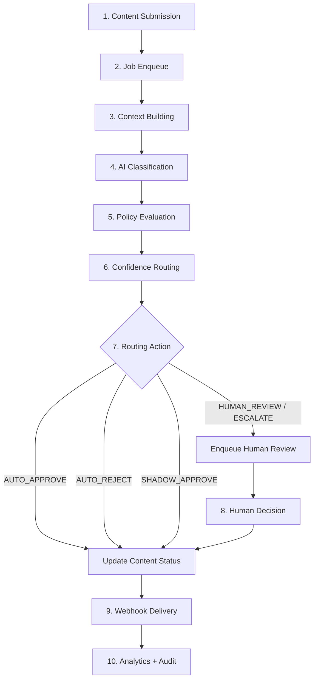
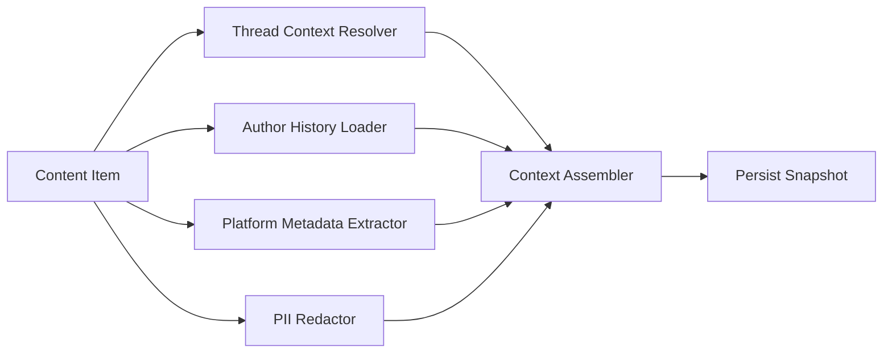
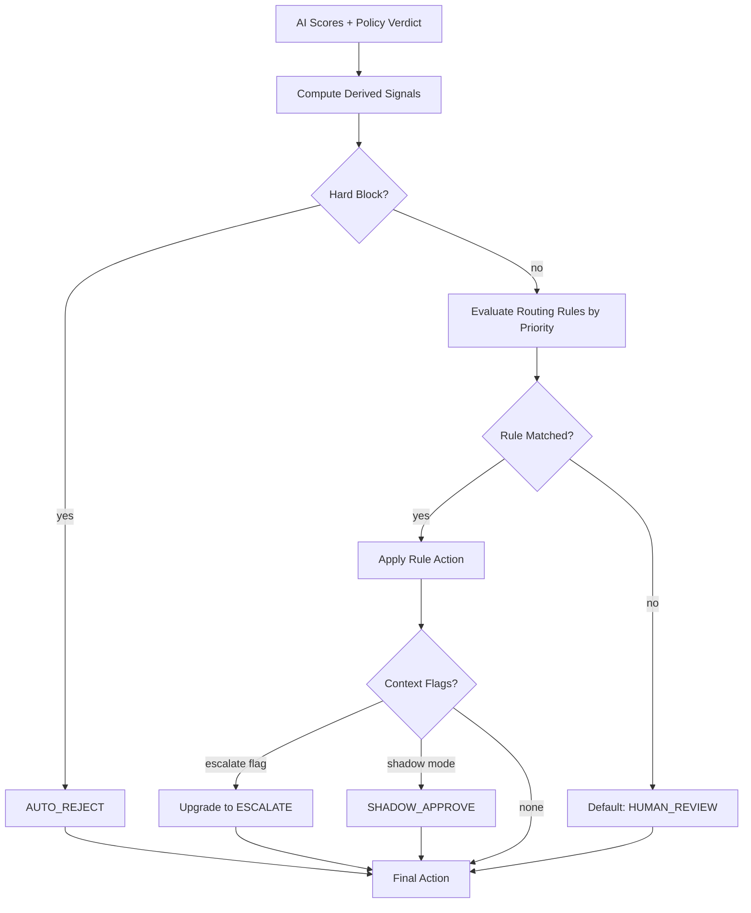
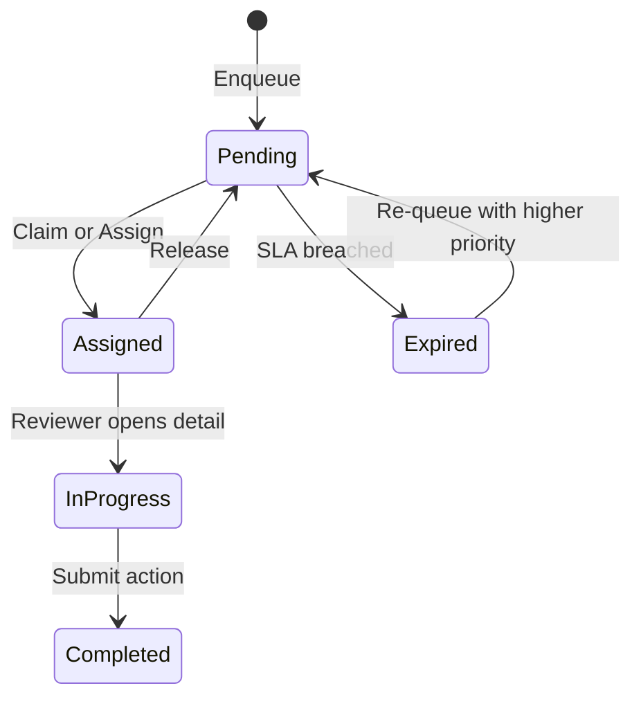
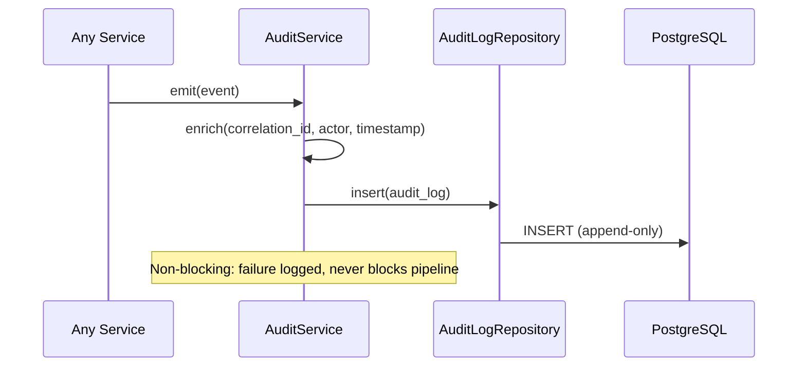
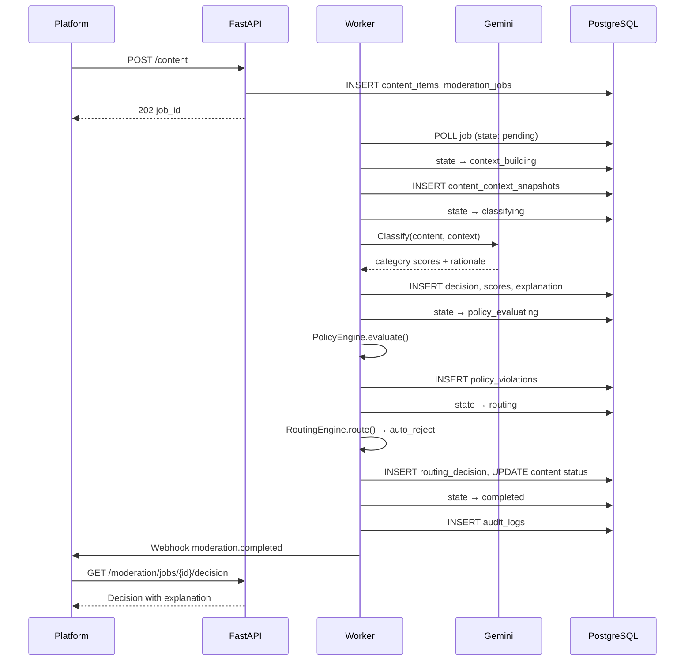
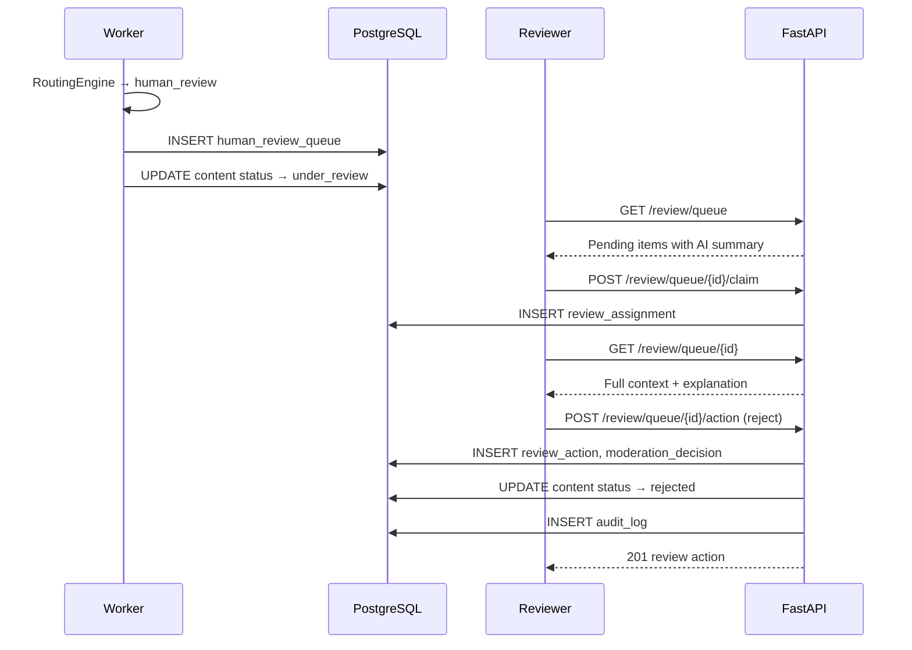

# Moderation Flow — Content Moderation Pipeline

## 1. Overview

This document describes the end-to-end workflows for content moderation, including context assembly, AI classification, policy evaluation, confidence-based routing, human review, and audit logging. Each workflow identifies responsible services, state transitions, persistence points, and failure behavior.

---

## 2. Step-by-Step Moderation Workflow

### 2.1 Workflow Diagram



### 2.2 Detailed Steps

#### Step 1: Content Submission

| Attribute | Detail |
|-----------|--------|
| **Trigger** | `POST /api/v1/content` |
| **Service** | `ContentService` |
| **Actions** | Validate payload; check idempotency key; compute `content_hash`; persist `content_items` (status: `pending`); create `content_versions` v1 |
| **Persistence** | `content_items`, `content_versions` |
| **Audit** | `content.submitted` |
| **Failure** | `409` on duplicate `external_id`; `422` on validation |

#### Step 2: Job Enqueue

| Attribute | Detail |
|-----------|--------|
| **Service** | `ModerationService` |
| **Actions** | Create `moderation_jobs` (state: `pending`); push job ID to Redis queue `moderation:jobs`; return `202` with `job_id` |
| **Persistence** | `moderation_jobs` |
| **Audit** | `moderation.job_created` |
| **Failure** | If Redis unavailable, persist job as `pending` and rely on DB polling fallback |

#### Step 3: Context Building

| Attribute | Detail |
|-----------|--------|
| **Worker** | Moderation Worker picks job from queue |
| **Service** | `ContextService` |
| **State** | `moderation_jobs.state` → `context_building` |
| **Actions** | See §3 Context Building Workflow |
| **Persistence** | `content_context_snapshots`, updated `author_moderation_history` |
| **Audit** | `moderation.context_built` |
| **Failure** | Retry up to 3×; on exhaustion → `failed`; content stays `pending` |

#### Step 4: AI Classification

| Attribute | Detail |
|-----------|--------|
| **Service** | `ClassificationService` |
| **State** | → `classifying` |
| **Actions** | Build prompt; call Gemini; validate output; create `moderation_decisions` (type: `ai`); bulk insert `decision_category_scores`; create `explanation_records` |
| **Persistence** | `moderation_decisions`, `decision_category_scores`, `explanation_records` |
| **Audit** | `classification.completed` with token count metadata |
| **Failure** | Gemini timeout → retry with backoff; validation failure → fallback zero-confidence scores → continues to policy (routes to human review) |

#### Step 5: Policy Evaluation

| Attribute | Detail |
|-----------|--------|
| **Service** | `PolicyEngine` |
| **State** | → `policy_evaluating` |
| **Actions** | Load active `platform_policies` + `policy_rules`; evaluate rules against content, AI scores, context; record `policy_violations`; create `moderation_decisions` (type: `policy`) or attach violations to AI decision |
| **Persistence** | `policy_violations`, decision record updated with `policy_version_id` |
| **Audit** | `policy.evaluated`, `policy.violation` (per triggered rule) |
| **Failure** | Missing active policy → use global default policy; config error → `failed` |

#### Step 6: Confidence Routing

| Attribute | Detail |
|-----------|--------|
| **Service** | `RoutingEngine` |
| **State** | → `routing` |
| **Actions** | Load `routing_rules`; evaluate decision matrix; create `routing_decisions`; create `moderation_decisions` (type: `routing`, `is_current: true`) |
| **Persistence** | `routing_decisions`, `moderation_decisions` |
| **Audit** | `routing.decided` with `routing_action` and matched rule |
| **Failure** | On any error → default `HUMAN_REVIEW` (fail-safe) |

#### Step 7: Execute Routing Action

| Routing Action | Behavior |
|----------------|----------|
| `AUTO_APPROVE` | `content_items.status` → `approved` |
| `AUTO_REJECT` | `content_items.status` → `rejected` |
| `SHADOW_APPROVE` | `content_items.status` → `approved`; flag in metadata for audit sampling |
| `HUMAN_REVIEW` | `content_items.status` → `under_review`; enqueue review (§5) |
| `ESCALATE` | Same as human review with `priority: 1`, shorter SLA |

**Job completion:** `moderation_jobs.state` → `completed`, `completed_at` set.

#### Step 8: Human Decision (Conditional)

Only when routing action is `HUMAN_REVIEW` or `ESCALATE`. See §5.

#### Step 9: Webhook Delivery

| Attribute | Detail |
|-----------|--------|
| **Service** | `WebhookService` |
| **Actions** | Build signed payload; POST to registered endpoints; record `webhook_deliveries` |
| **Events** | `moderation.completed`, `review.completed` |
| **Failure** | Retry 5× exponential backoff; mark `failed` after exhaustion |

#### Step 10: Analytics and Audit Finalization

| Attribute | Detail |
|-----------|--------|
| **Services** | `AnalyticsService`, `AuditService` |
| **Actions** | Increment Redis counters; emit `moderation.completed` audit event; queue hourly aggregate update |
| **Persistence** | `audit_logs`, Redis counters → `analytics_*` tables (batch) |

---

## 3. Context Building Workflow

### 3.1 Purpose

Enrich raw content with situational signals so the AI model and policy engine make informed, context-aware decisions rather than evaluating text in isolation.

### 3.2 Context Building Diagram



### 3.3 Step-by-Step

| Step | Action | Source | Output Field |
|------|--------|--------|--------------|
| 3.3.1 | Load content item and platform settings | `content_items`, `platforms` | Base payload |
| 3.3.2 | **Thread context** — if `metadata.parent_external_id` present, fetch parent content and up to 5 ancestor replies from platform metadata or prior moderated content | `content_items` (same platform) | `thread_context.conversation_chain[]` with `depth`, `body_text_truncated`, `author_external_id`, `prior_decision` |
| 3.3.3 | **Sibling context** — fetch up to 3 sibling replies to same parent | `content_items.metadata` | `thread_context.sibling_excerpts[]` |
| 3.3.4 | **Author history** — load or compute `author_moderation_history` | `author_moderation_history` | `author_history_summary`: `strike_count`, `total_rejections`, `days_since_last_violation`, `is_repeat_offender` (≥2 rejections in 90d) |
| 3.3.5 | **Platform context** — extract channel, audience rating, geo, content age | `content_items.metadata`, `platforms.settings_json` | `platform_context` |
| 3.3.6 | **Locale signals** — use submitted locale or lightweight detection | Content body | `locale_signals.detected_locale`, `confidence` |
| 3.3.7 | **PII redaction** — mask emails, phone numbers, credit card patterns in body and thread excerpts | Redaction rule set | `redaction_applied: true`, redacted body for AI prompt |
| 3.3.8 | **Persist snapshot** — immutable record linked to job | — | `content_context_snapshots` row |
| 3.3.9 | **Increment author stats** — `total_submissions += 1` | — | `author_moderation_history` upsert |

### 3.4 Context Quality Flags

The context snapshot includes quality indicators used by the routing engine:

| Flag | Condition | Routing Impact |
|------|-----------|----------------|
| `thread_escalation` | Parent or siblings were rejected | Lower auto-approve threshold |
| `author_repeat_offender` | `strike_count >= 2` | Escalate priority |
| `thin_context` | No parent, new author, no history | Default to human review if AI confidence 0.4–0.7 |
| `high_visibility` | `metadata.channel == promoted` | Escalate |

### 3.5 Context in AI Prompt

`ClassificationService` serializes the snapshot into a structured context block:

- Conversation thread (truncated, max 2000 tokens)
- Author summary (no PII beyond platform author ID)
- Platform channel and audience
- Explicit instruction: "Consider thread escalation and author history when scoring"

---

## 4. Confidence Routing Workflow

### 4.1 Purpose

Deterministically map AI confidence scores and policy verdicts to a routing action using configurable per-platform rules.

### 4.2 Routing Workflow Diagram



### 4.3 Derived Signals

Computed before rule evaluation:

| Signal | Calculation |
|--------|-------------|
| `max_confidence` | `MAX(confidence)` across all category scores |
| `max_triggered_category` | Category with highest confidence above its platform threshold |
| `triggered_count` | Count of categories where `is_triggered = true` |
| `policy_verdict` | From PolicyEngine: `clean`, `soft_flag`, `violation`, `hard_block` |
| `overall_risk_score` | Weighted sum of confidences × severity weights |

### 4.4 Rule Evaluation Algorithm

```
INPUT: platform_id, category_scores[], policy_verdict, context_flags
OUTPUT: routing_action, matched_rule_id, reasoning_trace[]

1. IF policy_verdict == "hard_block":
     RETURN auto_reject, null, ["hard_block_override"]

2. LOAD routing_rules FOR platform_id ORDER BY priority ASC
   (include global defaults where platform_id IS NULL)

3. FOR EACH rule IN routing_rules:
     IF rule.category_id IS NOT NULL:
       score = category_scores[rule.category_code].confidence
     ELSE:
       score = max_confidence

     IF score >= rule.min_confidence AND score <= rule.max_confidence:
       IF rule.policy_verdict_filter == "any" OR matches policy_verdict:
         APPEND match to reasoning_trace
         RETURN rule.routing_action, rule.id, reasoning_trace

4. IF max_confidence < platform.auto_approve_threshold AND policy_verdict == "clean":
     RETURN auto_approve, null, ["below_threshold_clean"]

5. IF max_confidence > platform.auto_reject_threshold AND policy_verdict IN ("violation", "hard_block"):
     RETURN auto_reject, null, ["above_threshold_violation"]

6. RETURN human_review, null, ["no_rule_matched_fail_safe"]
```

### 4.5 Context Adjustments (Post-Rule)

| Condition | Adjustment |
|-----------|------------|
| `context_flags.author_repeat_offender` AND action == `AUTO_APPROVE` | Upgrade to `HUMAN_REVIEW` |
| `context_flags.thread_escalation` AND action == `AUTO_APPROVE` | Upgrade to `HUMAN_REVIEW` |
| `routing_action == HUMAN_REVIEW` AND `context_flags.high_visibility` | Upgrade to `ESCALATE` |
| Platform `shadow_mode_enabled` AND action == `AUTO_APPROVE` AND `max_confidence > 0.5` | Change to `SHADOW_APPROVE` |

### 4.6 Confidence Band Examples (Default Global Rules)

| Band | Confidence Range | Policy | Action |
|------|------------------|--------|--------|
| Safe | 0.00 – 0.30 | clean | `AUTO_APPROVE` |
| Uncertain low | 0.30 – 0.60 | any | `HUMAN_REVIEW` |
| Uncertain high | 0.60 – 0.85 | clean | `HUMAN_REVIEW` |
| High risk | 0.85 – 1.00 | violation | `AUTO_REJECT` |
| High confidence clean | 0.60 – 0.85 | clean | `AUTO_APPROVE` (category-specific) |

### 4.7 Routing Persistence

All routing outcomes are persisted atomically:

1. Insert `routing_decisions` with full `reasoning_trace`.
2. Insert `moderation_decisions` (type: `routing`) with `is_current = true`.
3. Set `is_current = false` on prior decisions for same content.
4. Emit audit event `routing.decided`.

---

## 5. Human Review Workflow

### 5.1 Purpose

Provide a structured queue for human moderators to review content that the automated pipeline could not confidently adjudicate, or that policy/routing explicitly escalated.

### 5.2 Human Review Diagram



### 5.3 Enqueue Step

| Attribute | Detail |
|-----------|--------|
| **Trigger** | Routing action = `HUMAN_REVIEW` or `ESCALATE` |
| **Service** | `HumanReviewService` |
| **Actions** | Create `human_review_queue` (status: `pending`); compute `sla_deadline` based on priority; add to Redis sorted set for fast priority dequeue |
| **SLA by Priority** | P1: 1h, P2: 2h, P3: 4h, P4: 8h, P5: 24h |
| **Audit** | `review.enqueued` |

**Priority assignment:**

| Source | Priority |
|--------|----------|
| `ESCALATE` routing | 1 |
| `author_repeat_offender` | 2 |
| `thread_escalation` | 2 |
| Default `HUMAN_REVIEW` | 3 |
| Re-queued after expiry | Priority - 1 (min 1) |

### 5.4 Assignment Step

| Mode | Description |
|------|-------------|
| **Claim** | Reviewer calls `POST /review/queue/{id}/claim`; FIFO within priority band |
| **Auto-assign** | Background task assigns based on round-robin or `expertise_categories` match |
| **Manual** | Senior reviewer/admin assigns specific reviewer |

On assignment:
- `human_review_queue.queue_status` → `assigned`
- Create `review_assignments` (status: `active`)
- Audit: `review.assigned`

### 5.5 Review Step

Reviewer opens `GET /review/queue/{queue_item_id}` and sees:

1. Full content (not truncated)
2. Context snapshot (thread, author history)
3. AI category scores with confidence bars
4. AI rationale per category (explainability)
5. Policy violations with matched rules
6. Routing reasoning trace
7. Prior decisions on same content (if resubmission)

`queue_status` → `in_progress` on first view.

### 5.6 Decision Step

| Action | Outcome |
|--------|---------|
| `approve` | `content_items.status` → `approved` |
| `reject` | `content_items.status` → `rejected`; `author_moderation_history.total_rejections += 1`; possibly `strike_count += 1` |
| `escalate` | Re-enqueue at priority 1 for senior reviewer |
| `request_edit` | `content_items.status` → `pending`; notify platform via webhook |

On action:
1. Create `review_actions` record.
2. Create new `moderation_decisions` (type: `human_override`, `is_current: true`).
3. Mark `human_review_queue.queue_status` → `completed`.
4. Mark `review_assignments.status` → `completed`.
5. Audit: `review.completed` with `override_ai` flag.
6. Trigger webhook: `review.completed`.
7. Update `analytics_reviewer_metrics`.

### 5.7 SLA Monitoring

Background job runs every 5 minutes:

| Condition | Action |
|-----------|--------|
| `now > sla_deadline` AND status in (`pending`, `assigned`) | Audit `review.sla_breached`; notify ops; optionally auto-escalate priority |
| Assignment idle > 30 min | Release assignment back to `pending` |

### 5.8 Override Tracking

`override_ai = true` when human action differs from AI `recommended_action`. Tracked in analytics for model quality feedback.

---

## 6. Audit Logging Workflow

### 6.1 Purpose

Maintain an immutable, queryable record of every significant action for compliance, dispute resolution, and debugging.

### 6.2 Audit Principles

| Principle | Implementation |
|-----------|----------------|
| **Append-only** | INSERT only; no UPDATE/DELETE on `audit_logs` |
| **Complete** | Every state transition in moderation and review emits an event |
| **Correlated** | Same `correlation_id` from API request through pipeline |
| **Actor-attributed** | Every event has `actor_type` and `actor_id` |
| **Before/after** | State changes capture `before_state` and `after_state` JSON |

### 6.3 Audit Event Catalog

| Event | Actor | Entity | When |
|-------|-------|--------|------|
| `content.submitted` | api_client | content_item | POST /content |
| `content.resubmitted` | api_client | content_item | POST resubmit |
| `moderation.job_created` | system | moderation_job | Job enqueued |
| `moderation.state_changed` | system | moderation_job | Each state transition |
| `moderation.context_built` | system | content_context_snapshot | Context step done |
| `classification.completed` | ai | moderation_decision | AI scores persisted |
| `classification.fallback` | system | moderation_decision | Gemini failure fallback |
| `policy.evaluated` | system | moderation_decision | Policy step done |
| `policy.violation` | system | policy_violation | Rule triggered |
| `routing.decided` | system | routing_decision | Routing complete |
| `moderation.completed` | system | content_item | Pipeline finished |
| `moderation.failed` | system | moderation_job | Pipeline failed |
| `review.enqueued` | system | human_review_queue | Sent to review |
| `review.assigned` | reviewer/admin | review_assignment | Assignment created |
| `review.released` | reviewer | review_assignment | Assignment released |
| `review.completed` | reviewer | review_action | Decision submitted |
| `review.sla_breached` | system | human_review_queue | SLA missed |
| `policy.published` | admin | platform_policy | Policy activated |
| `routing.rule_changed` | admin | routing_rule | Rule CRUD |
| `webhook.delivered` | system | webhook_delivery | Callback success |
| `webhook.failed` | system | webhook_delivery | Callback failed |
| `platform.api_key_rotated` | admin | platform | Key rotation |

### 6.4 Audit Write Flow



**Non-blocking guarantee:** Audit write failures are logged at `ERROR` level and retried asynchronously; they never block moderation decisions.

### 6.5 Audit Record Structure

Each record contains:

```json
{
  "correlation_id": "request-uuid",
  "actor_type": "system",
  "actor_id": null,
  "action": "routing.decided",
  "entity_type": "routing_decision",
  "entity_id": "decision-uuid",
  "before_state": { "content_status": "pending" },
  "after_state": { "content_status": "rejected", "routing_action": "auto_reject" },
  "metadata": {
    "matched_rule_id": "...",
    "max_confidence": 0.92,
    "platform_id": "..."
  }
}
```

### 6.6 Content Timeline Query

`GET /audit/content/{content_id}/timeline` aggregates events across:

- `content_item` (the content itself)
- `moderation_job` (all jobs for content)
- `moderation_decision` (all decisions)
- `human_review_queue` (review cycles)
- `review_action` (human decisions)
- `webhook_delivery` (notifications)

Sorted chronologically with `summary` field for UI display.

### 6.7 Retention and Compliance

| Policy | Detail |
|--------|--------|
| Retention | Minimum 7 years for audit logs (configurable per compliance regime) |
| Partitioning | Monthly partitions; archived to cold storage after 12 months |
| Access control | `senior_reviewer` and `admin` only; reviewer sees own `review.*` events |
| Export | Admin bulk export for legal discovery (future endpoint) |

---

## 7. End-to-End Sequence (Happy Path — Auto Reject)



---

## 8. End-to-End Sequence (Human Review Path)



---

## 9. Failure and Retry Matrix

| Stage | Retryable | Max Attempts | Fallback |
|-------|-----------|--------------|----------|
| Context build | Yes | 3 | `failed` |
| Gemini call | Yes | 3 (exponential backoff) | Zero-confidence → human review |
| Policy eval | Config errors: No | 1 | `failed` |
| Routing | Yes | 1 | `HUMAN_REVIEW` |
| Webhook | Yes | 5 | `failed` status, manual replay |
| Audit write | Yes | 3 (async) | Error log only |

---

## 10. Potential Risks and Improvements

### 10.1 Risks

| Risk | Description |
|------|-------------|
| **Pipeline ordering** | Re-submission during active review can cause race conditions on `is_current` decision |
| **Stale context** | Thread context built from cached content may not reflect edits made milliseconds earlier |
| **Reviewer inconsistency** | Different reviewers may disagree on borderline content |
| **SLA avalanche** | Traffic spike fills queue faster than reviewers can process |
| **Audit gap** | Non-blocking audit can theoretically lose events under sustained DB pressure |
| **Override without feedback** | Human overrides not fed back to AI model in v1 |
| **Shadow approve blind spot** | Approved content flagged for sampling may never be reviewed |

### 10.2 Improvements

| Area | Recommendation |
|------|-------------|
| **Concurrency** | Lock content row during active moderation job; reject concurrent resubmits with `409` |
| **Context freshness** | Re-fetch parent content at classification time if job age > 30s |
| **Review quality** | Dual-review for P1 items; inter-rater agreement metrics |
| **Queue management** | Dynamic reviewer scaling alerts; auto-raise priority on SLA approach |
| **Audit durability** | Write-ahead to Redis stream before PostgreSQL insert |
| **AI feedback loop** | Export override pairs for periodic fine-tuning / eval |
| **Sampling** | Dedicated post-hoc review queue for `SHADOW_APPROVE` items at 5% sample rate |
| **Dispute flow** | Allow platform to contest decisions with re-review API |

---

## 11. Workflow Summary Table

| Workflow | Entry Point | Exit Point | Key Output |
|----------|-------------|------------|------------|
| Moderation | `POST /content` | Webhook / decision API | `moderation_decisions`, content status |
| Context building | Worker: `context_building` | Snapshot persisted | `content_context_snapshots` |
| Confidence routing | Post-policy evaluation | `routing_decisions` | `routing_action` |
| Human review | `HUMAN_REVIEW` / `ESCALATE` | `POST .../action` | `review_actions`, override decision |
| Audit logging | Every state change | `audit_logs` insert | Immutable event record |
