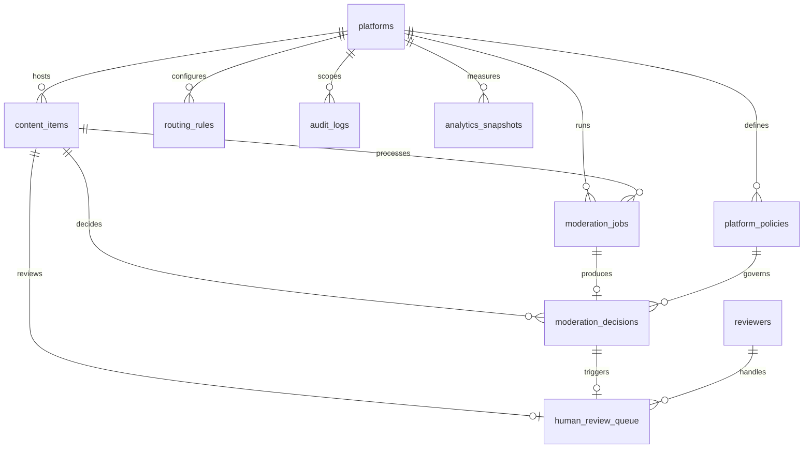
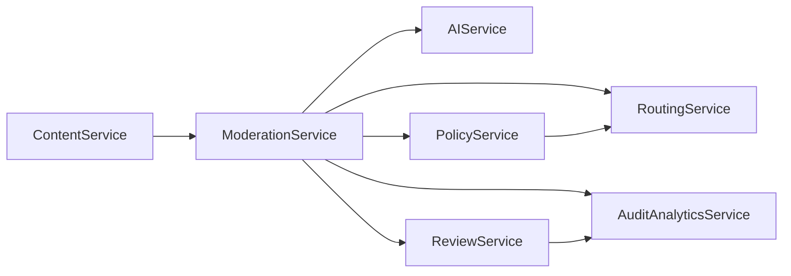
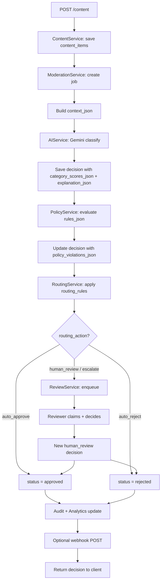

# MVP Architecture — Content Moderation Pipeline (University Project)

## 1. Purpose

This document simplifies the approved full architecture into an **implementation-focused MVP** suitable for a university assignment. All assignment requirements are preserved; operational and enterprise extras are removed or merged.

### Assignment Requirements Preserved

| Requirement | MVP Approach |
|-------------|--------------|
| Multi-category classification | Gemini returns scores per category; stored as `category_scores_json` on `moderation_decisions` |
| Context-aware moderation | Context built at job start; stored as `context_json` on `moderation_jobs` |
| Confidence-based routing | `routing_rules` table + `RoutingService` |
| Explainable decisions | `explanation_json` on `moderation_decisions` |
| Human review queue | `human_review_queue` table + `ReviewService` |
| Platform-specific policies | `platform_policies` with embedded `rules_json` |
| Auditability | Append-only `audit_logs` |
| Analytics dashboard | Single `analytics_snapshots` table + summary API |

### Simplification Principles

| Principle | Decision |
|-----------|----------|
| JSON over normalization | Category scores, explanations, routing trace, policy violations stored as JSONB columns |
| Inline over separate tables | Context on jobs; review assignment on queue row |
| Sync over async (default) | Run pipeline inline on submit; optional background worker later |
| Single webhook URL | `platforms.webhook_url` only; no delivery tracking table |
| Compute over denormalize | Author history computed from past decisions, not a separate table |
| Seed categories in code | Category taxonomy as constants; no `moderation_categories` table |

---

## 2. Tables: Merge and Remove Analysis

### 2.1 Merge Map

| Original Table(s) | Merged Into | Rationale |
|-------------------|-------------|-----------|
| `content_versions` | `content_items` | MVP resubmit overwrites `body_text`; version history not required for assignment |
| `content_context_snapshots` | `moderation_jobs.context_json` | One snapshot per job; no need for standalone table |
| `author_moderation_history` | Computed at runtime | Simple `COUNT` on past `moderation_decisions` by `author_external_id` |
| `decision_category_scores` | `moderation_decisions.category_scores_json` | JSON array is sufficient for demo and dashboard |
| `routing_decisions` | `moderation_decisions` columns | `routing_action`, `routing_trace_json` on same row |
| `explanation_records` | `moderation_decisions.explanation_json` | 1:1 with decision; no separate table needed |
| `policy_violations` | `moderation_decisions.policy_violations_json` | Small list per decision; JSON is fine |
| `policy_rules` | `platform_policies.rules_json` | Policies edited as a document; rules as JSON array |
| `review_assignments` | `human_review_queue` | One reviewer per item; add `reviewer_id`, `assigned_at` columns |
| `review_actions` | `human_review_queue` + `moderation_decisions` | Queue stores action; new decision row for human override |
| `webhook_endpoints` | `platforms.webhook_url` | One callback URL per platform is enough |
| `webhook_deliveries` | *(removed)* | Fire-and-forget webhook; log success/failure in `audit_logs` only |
| `analytics_daily_aggregates` + `analytics_category_metrics` + `analytics_reviewer_metrics` | `analytics_snapshots` | One row per platform per day with `metrics_json` breakdown |
| `moderation_categories` | Python constants | Fixed taxonomy seeded in code; scores reference `category_code` strings |

### 2.2 Tables Kept As-Is (Simplified Columns)

| Table | Why Kept |
|-------|----------|
| `platforms` | Multi-tenancy and platform-specific config |
| `content_items` | Core entity |
| `moderation_jobs` | Pipeline state tracking (assignment demo) |
| `moderation_decisions` | Central decision record with merged JSON fields |
| `platform_policies` | Platform-specific policies (assignment requirement) |
| `routing_rules` | Confidence-based routing (assignment requirement) |
| `human_review_queue` | Human review queue (assignment requirement) |
| `reviewers` | Reviewer accounts for queue actions |
| `audit_logs` | Auditability (assignment requirement) |
| `analytics_snapshots` | Analytics dashboard (assignment requirement) |

---

## 3. REMOVED TABLES

| Table | Why Unnecessary for Assignment |
|-------|-------------------------------|
| `content_versions` | Version history is an enterprise feature; resubmit can update content in place |
| `content_context_snapshots` | Context is consumed once per job; storing on `moderation_jobs` is sufficient |
| `author_moderation_history` | Author stats derivable from existing decisions with a simple query |
| `moderation_categories` | Fixed taxonomy in application constants reduces migrations and seed complexity |
| `decision_category_scores` | Normalized scores add joins; JSON array on decision is enough for multi-category display |
| `routing_decisions` | 1:1 with decision; columns on `moderation_decisions` suffice |
| `explanation_records` | 1:1 with decision; `explanation_json` column suffices |
| `policy_rules` | Separate rule rows add CRUD complexity; embedded `rules_json` is faster to implement |
| `policy_violations` | Small derived list; stored as JSON on decision |
| `review_assignments` | MVP uses single assignment per queue item |
| `review_actions` | Review outcome captured on queue row + new `moderation_decisions` row |
| `webhook_endpoints` | Multiple webhooks per platform not needed for demo |
| `webhook_deliveries` | Delivery retry tracking is production ops, not assignment scope |
| `analytics_category_metrics` | Merged into `analytics_snapshots.metrics_json` |
| `analytics_reviewer_metrics` | Merged into `analytics_snapshots.metrics_json` |
| `analytics_daily_aggregates` | Renamed/merged into `analytics_snapshots` |

**Removed: 15 tables** (25 → 10)

---

## 4. Final MVP Schema (10 Tables)

### 4.1 ERD



### 4.2 Table Definitions

#### `platforms`

| Column | Type | Notes |
|--------|------|-------|
| `id` | UUID PK | |
| `name` | VARCHAR(128) | |
| `slug` | VARCHAR(64) UNIQUE | |
| `api_key_hash` | VARCHAR(128) | |
| `webhook_url` | TEXT NULL | Single outbound callback |
| `settings_json` | JSONB | `auto_approve_threshold`, `auto_reject_threshold`, `sla_hours` |
| `created_at` | TIMESTAMPTZ | |
| `updated_at` | TIMESTAMPTZ | |

#### `content_items`

| Column | Type | Notes |
|--------|------|-------|
| `id` | UUID PK | |
| `platform_id` | UUID FK | |
| `external_id` | VARCHAR(256) | UNIQUE per platform |
| `content_type` | VARCHAR(32) | `text`, `image`, `video`, `mixed` |
| `body_text` | TEXT NULL | |
| `media_urls` | JSONB NULL | |
| `author_external_id` | VARCHAR(256) | |
| `locale` | VARCHAR(10) NULL | |
| `metadata_json` | JSONB NULL | Thread parent ID, channel, etc. |
| `status` | VARCHAR(20) | `pending`, `approved`, `rejected`, `under_review` |
| `created_at` | TIMESTAMPTZ | |
| `updated_at` | TIMESTAMPTZ | |

#### `moderation_jobs`

| Column | Type | Notes |
|--------|------|-------|
| `id` | UUID PK | Public `job_id` |
| `content_id` | UUID FK | |
| `platform_id` | UUID FK | Denormalized |
| `state` | VARCHAR(32) | `pending` → `completed` / `failed` |
| `context_json` | JSONB NULL | **Merged context snapshot** (thread, author stats, platform context) |
| `error_message` | TEXT NULL | |
| `started_at` | TIMESTAMPTZ NULL | |
| `completed_at` | TIMESTAMPTZ NULL | |
| `created_at` | TIMESTAMPTZ | |

#### `moderation_decisions`

| Column | Type | Notes |
|--------|------|-------|
| `id` | UUID PK | |
| `content_id` | UUID FK | |
| `job_id` | UUID FK NULL | |
| `platform_id` | UUID FK | |
| `policy_id` | UUID FK NULL | Active policy at decision time |
| `decision_source` | VARCHAR(20) | `ai_pipeline`, `human_review` |
| `final_action` | VARCHAR(20) | `approve`, `reject`, `pending` |
| `routing_action` | VARCHAR(32) | `auto_approve`, `auto_reject`, `human_review`, `escalate` |
| `overall_risk_score` | NUMERIC(5,4) NULL | |
| `category_scores_json` | JSONB | **Multi-category scores** |
| `explanation_json` | JSONB | **Explainable decisions** (rationales, context factors, model version) |
| `policy_violations_json` | JSONB NULL | Triggered rules |
| `routing_trace_json` | JSONB NULL | Matched rule, reasoning steps |
| `is_current` | BOOLEAN | Latest decision for content |
| `reviewer_id` | UUID FK NULL | Set when `decision_source = human_review` |
| `created_at` | TIMESTAMPTZ | |

**`category_scores_json` example:**

```json
[
  { "category_code": "HATE_SPEECH", "confidence": 0.91, "severity": "high" },
  { "category_code": "SPAM", "confidence": 0.12, "severity": "low" }
]
```

**`explanation_json` example:**

```json
{
  "rationales": [
    { "category_code": "HATE_SPEECH", "text": "Targeted slur against a protected group." }
  ],
  "context_factors": ["author_prior_rejections: 2", "thread_escalation"],
  "model_version": "gemini-2.0-flash",
  "prompt_version": "v1"
}
```

#### `platform_policies`

| Column | Type | Notes |
|--------|------|-------|
| `id` | UUID PK | |
| `platform_id` | UUID FK | |
| `version_label` | VARCHAR(32) | e.g. `v1.0` |
| `status` | VARCHAR(20) | `draft`, `active`, `archived` |
| `description` | TEXT NULL | |
| `rules_json` | JSONB | **Embedded policy rules** |
| `created_at` | TIMESTAMPTZ | |

**`rules_json` example:**

```json
[
  {
    "rule_type": "keyword_blocklist",
    "name": "Prohibited slurs",
    "condition": { "keywords": ["..."], "match_mode": "whole_word" },
    "action": "hard_block",
    "priority": 10
  },
  {
    "rule_type": "ai_score_floor",
    "name": "Hate speech floor",
    "condition": { "category_code": "HATE_SPEECH", "min_score": 0.70 },
    "action": "violation",
    "priority": 20
  }
]
```

#### `routing_rules`

| Column | Type | Notes |
|--------|------|-------|
| `id` | UUID PK | |
| `platform_id` | UUID FK NULL | NULL = global default |
| `category_code` | VARCHAR(64) NULL | NULL = any category |
| `min_confidence` | NUMERIC(5,4) | |
| `max_confidence` | NUMERIC(5,4) | |
| `policy_verdict` | VARCHAR(20) | `any`, `clean`, `violation` |
| `routing_action` | VARCHAR(32) | |
| `priority` | SMALLINT | Lower = higher precedence |
| `is_active` | BOOLEAN | |
| `created_at` | TIMESTAMPTZ | |

#### `human_review_queue`

| Column | Type | Notes |
|--------|------|-------|
| `id` | UUID PK | |
| `content_id` | UUID FK | |
| `decision_id` | UUID FK | AI decision that triggered review |
| `platform_id` | UUID FK | |
| `status` | VARCHAR(20) | `pending`, `assigned`, `completed` |
| `priority` | SMALLINT | 1 (highest) – 5 |
| `reviewer_id` | UUID FK NULL | **Merged assignment** |
| `assigned_at` | TIMESTAMPTZ NULL | |
| `review_action` | VARCHAR(20) NULL | `approve`, `reject` (set on completion) |
| `review_notes` | TEXT NULL | |
| `sla_deadline` | TIMESTAMPTZ | |
| `completed_at` | TIMESTAMPTZ NULL | |
| `created_at` | TIMESTAMPTZ | |

#### `reviewers`

| Column | Type | Notes |
|--------|------|-------|
| `id` | UUID PK | |
| `email` | VARCHAR(256) UNIQUE | |
| `display_name` | VARCHAR(128) | |
| `password_hash` | VARCHAR(256) | Simple auth for demo |
| `role` | VARCHAR(20) | `reviewer`, `admin` |
| `is_active` | BOOLEAN | |
| `created_at` | TIMESTAMPTZ | |

#### `audit_logs`

| Column | Type | Notes |
|--------|------|-------|
| `id` | UUID PK | |
| `platform_id` | UUID FK NULL | |
| `correlation_id` | UUID | Request/job ID |
| `actor_type` | VARCHAR(20) | `system`, `ai`, `reviewer`, `api_client` |
| `actor_id` | VARCHAR(256) NULL | |
| `action` | VARCHAR(64) | e.g. `moderation.completed` |
| `entity_type` | VARCHAR(64) | |
| `entity_id` | UUID | |
| `metadata_json` | JSONB NULL | Before/after state, details |
| `created_at` | TIMESTAMPTZ | |

#### `analytics_snapshots`

| Column | Type | Notes |
|--------|------|-------|
| `id` | UUID PK | |
| `platform_id` | UUID FK | |
| `snapshot_date` | DATE | |
| `metrics_json` | JSONB | All dashboard metrics |
| `created_at` | TIMESTAMPTZ | |

**`metrics_json` example:**

```json
{
  "totals": {
    "submitted": 120,
    "auto_approved": 80,
    "auto_rejected": 15,
    "human_reviewed": 25
  },
  "latency_avg_ms": 2100,
  "ai_override_rate_pct": 14.0,
  "categories": [
    { "code": "SPAM", "count": 30, "avg_confidence": 0.89 }
  ],
  "reviewers": [
    { "reviewer_id": "...", "items_reviewed": 12 }
  ]
}
```

### 4.3 Category Taxonomy (Application Constants)

Not stored in DB. Seeded in code:

`HATE_SPEECH`, `HARASSMENT`, `SPAM`, `MISINFORMATION`, `VIOLENCE`, `SEXUAL_CONTENT`, `SELF_HARM`, `PII_SHARING`

### 4.4 Key Indexes (MVP)

| Table | Index |
|-------|-------|
| `content_items` | `UNIQUE (platform_id, external_id)` |
| `moderation_jobs` | `(state, created_at)` |
| `moderation_decisions` | `(content_id) WHERE is_current = true` |
| `human_review_queue` | `(platform_id, status, priority, created_at)` |
| `platform_policies` | `UNIQUE (platform_id) WHERE status = 'active'` |
| `routing_rules` | `(platform_id, is_active, priority)` |
| `audit_logs` | `(entity_type, entity_id, created_at DESC)` |
| `analytics_snapshots` | `UNIQUE (platform_id, snapshot_date)` |

---

## 5. Final Service List (7 Services)

| # | Service | Responsibility | Replaces (Full Arch) |
|---|---------|----------------|----------------------|
| 1 | **ContentService** | Submit content, get status, resubmit | `ContentService` |
| 2 | **ModerationService** | Job orchestration, context building, pipeline state machine | `ModerationService` + `ContextService` |
| 3 | **AIService** | Gemini classification, output validation, explanation assembly | `ClassificationService` |
| 4 | **PolicyService** | Load active policy, evaluate `rules_json`, produce violations | `PolicyEngine` |
| 5 | **RoutingService** | Evaluate `routing_rules`, set `routing_action`, fail-safe to human review | `RoutingEngine` |
| 6 | **ReviewService** | Queue list/claim/complete, create human override decision | `HumanReviewService` |
| 7 | **AuditAnalyticsService** | Append audit logs, compute/update analytics snapshots, dashboard queries | `AuditService` + `AnalyticsService` |

### 5.1 Service Interaction



### 5.2 REMOVED SERVICES

| Service | Why Removed |
|---------|-------------|
| **ContextService** | Context building is ~50 lines inside `ModerationService`; not worth a separate class for MVP |
| **ClassificationService** | Renamed/slimmed to `AIService`; same responsibility, clearer name |
| **HumanReviewService** | Renamed to `ReviewService` |
| **AuditService** | Merged into `AuditAnalyticsService` — both are write-light/query-light |
| **AnalyticsService** | Merged into `AuditAnalyticsService` — analytics updated on pipeline completion |
| **PlatformService** | Platform CRUD handled directly in admin routes + `PlatformRepository`; no business logic layer needed |
| **WebhookService** | Simple `httpx.post` call inside `ModerationService` after completion; no retry table |

---

## 6. Final Repository List (8 Repositories)

| # | Repository | Tables Accessed |
|---|------------|-----------------|
| 1 | **PlatformRepository** | `platforms` |
| 2 | **ContentRepository** | `content_items` |
| 3 | **ModerationRepository** | `moderation_jobs`, `moderation_decisions` |
| 4 | **PolicyRepository** | `platform_policies` |
| 5 | **RoutingRuleRepository** | `routing_rules` |
| 6 | **ReviewRepository** | `human_review_queue`, `reviewers` |
| 7 | **AuditRepository** | `audit_logs` |
| 8 | **AnalyticsRepository** | `analytics_snapshots` |

### 6.1 REMOVED REPOSITORIES

| Repository | Why Removed |
|------------|-------------|
| `ContentVersionRepository` | No `content_versions` table |
| `ContextRepository` | Context stored on `moderation_jobs` via `ModerationRepository` |
| `AuthorHistoryRepository` | Author stats computed in `ModerationService` query |
| `ModerationJobRepository` | Merged into `ModerationRepository` |
| `ModerationDecisionRepository` | Merged into `ModerationRepository` |
| `CategoryRepository` | Categories are code constants |
| `DecisionCategoryScoreRepository` | Scores in JSON on decisions |
| `RoutingDecisionRepository` | Routing fields on `moderation_decisions` |
| `ExplanationRepository` | Explanations in JSON on decisions |
| `ReviewQueueRepository` | Merged into `ReviewRepository` |
| `ReviewAssignmentRepository` | Assignment columns on `human_review_queue` |
| `ReviewActionRepository` | Review outcome on queue + new decision row |
| `WebhookRepository` | No webhook delivery table |

---

## 7. Final Moderation Workflow

### 7.1 Flow Diagram



### 7.2 Step-by-Step (MVP — Synchronous Default)

| Step | Owner | Action |
|------|-------|--------|
| 1 | `ContentService` | Validate payload; insert `content_items` (`status: pending`) |
| 2 | `ModerationService` | Create `moderation_jobs` (`state: pending`) |
| 3 | `ModerationService` | Build `context_json`: fetch parent content from metadata, query author rejection count from past decisions, attach platform settings |
| 4 | `AIService` | Call Gemini with content + context; parse multi-category scores; build `explanation_json` |
| 5 | `ModerationService` | Insert `moderation_decisions` with scores and explanation (`decision_source: ai_pipeline`) |
| 6 | `PolicyService` | Load active `platform_policies`; evaluate each rule in `rules_json`; write `policy_violations_json` |
| 7 | `RoutingService` | Match `routing_rules`; set `routing_action` and `routing_trace_json`; default `human_review` on no match |
| 8 | `ModerationService` | Update decision `final_action`; set `is_current = true` |
| 9a | If auto action | Update `content_items.status`; job `state: completed` |
| 9b | If human review | Insert `human_review_queue`; `content_items.status: under_review`; return decision with `routing_action: human_review` |
| 10 | `AuditAnalyticsService` | Insert `audit_logs`; increment `analytics_snapshots` for today |
| 11 | `ModerationService` | POST to `platforms.webhook_url` if configured (log result in audit) |

### 7.3 Human Review Sub-Flow

| Step | Owner | Action |
|------|-------|--------|
| 1 | `ReviewService` | `GET /review/queue` — list `pending` items by priority |
| 2 | `ReviewService` | `POST /review/queue/{id}/claim` — set `reviewer_id`, `status: assigned` |
| 3 | Reviewer | `GET /review/queue/{id}` — see content, `context_json`, AI scores, `explanation_json` |
| 4 | `ReviewService` | `POST /review/queue/{id}/action` — set `review_action`, `review_notes`, `status: completed` |
| 5 | `ModerationService` | Create new `moderation_decisions` (`decision_source: human_review`); flip `is_current` |
| 6 | `AuditAnalyticsService` | Audit `review.completed`; update analytics override count |

---

## 8. Final API List (22 Endpoints)

Base path: `/api/v1`

| # | Method | Path | Role | Purpose |
|---|--------|------|------|---------|
| 1 | GET | `/health` | public | Liveness check |
| 2 | POST | `/content` | platform | Submit content + run moderation |
| 3 | GET | `/content/{content_id}` | platform | Get content and status |
| 4 | GET | `/content/{content_id}/decision` | platform | Get current decision with explanation |
| 5 | GET | `/moderation/jobs/{job_id}` | platform | Job status (if async used later) |
| 6 | GET | `/review/queue` | reviewer | List review queue |
| 7 | GET | `/review/queue/{id}` | reviewer | Queue item detail |
| 8 | POST | `/review/queue/{id}/claim` | reviewer | Claim item |
| 9 | POST | `/review/queue/{id}/action` | reviewer | Submit review decision |
| 10 | GET | `/policies` | admin | List policies for platform |
| 11 | POST | `/policies` | admin | Create policy with `rules_json` |
| 12 | GET | `/policies/{id}` | admin | Get policy |
| 13 | POST | `/policies/{id}/publish` | admin | Activate policy |
| 14 | GET | `/routing/rules` | admin | List routing rules |
| 15 | POST | `/routing/rules` | admin | Create routing rule |
| 16 | PATCH | `/routing/rules/{id}` | admin | Update routing rule |
| 17 | GET | `/analytics/summary` | platform/admin | Dashboard summary |
| 18 | GET | `/analytics/categories` | platform/admin | Per-category breakdown |
| 19 | GET | `/audit/logs` | admin | Query audit trail |
| 20 | GET | `/audit/content/{content_id}` | admin | Content audit timeline |
| 21 | POST | `/auth/login` | reviewer | Reviewer JWT login |
| 22 | GET | `/categories` | any auth | List category taxonomy (from constants) |

### 8.1 APIs Removed from Full Design

| Removed Endpoint | Why |
|------------------|-----|
| `GET /ready` | Optional; `GET /health` sufficient for university demo |
| `GET /content/{id}/versions` | No version table |
| `POST /content/{id}/resubmit` | Can resubmit via `POST /content` with same `external_id` (upsert) |
| `GET /moderation/decisions/{id}` | Covered by `GET /content/{id}/decision` |
| `GET /content/{id}/decisions` | History nice-to-have; single current decision enough for MVP |
| `POST /review/queue/{id}/assign` | Claim-only workflow simpler |
| `POST /review/queue/{id}/release` | Not needed for single-reviewer demo |
| `GET /review/metrics/me` | Reviewer metrics inside analytics dashboard |
| `PATCH /policies/{id}` | Create new version instead of patch |
| `POST /policies/{id}/simulate` | Optional demo feature |
| `DELETE /routing/rules/{id}` | Deactivate via `PATCH is_active=false` |
| `GET /analytics/reviewers` | Included in `metrics_json` |
| `GET/POST/DELETE /platforms/*` | Seed 1–2 platforms via migration |
| `GET/POST/DELETE /webhooks/*` | `webhook_url` on platform record |
| `POST /platforms/{id}/rotate-api-key` | Out of scope |

---

## 9. MVP vs Full Architecture Comparison

| Dimension | Full Architecture | MVP |
|-----------|-------------------|-----|
| Tables | 25 | **10** |
| Services | 11 | **7** |
| Repositories | 20 | **8** |
| API endpoints | 40 | **22** |
| Job processing | Async worker default | **Sync inline** (worker optional stretch goal) |
| Policy rules | Normalized table | **JSON array** on policy |
| Category scores | Normalized table | **JSON array** on decision |
| Webhooks | Multi-endpoint + delivery log | **Single URL**, audit-only logging |
| Review workflow | Assign, release, claim, escalate roles | **Claim + action** only |
| Analytics | 3 aggregate tables | **1 snapshot table** |

---

## 10. Implementation Order (Suggested)

| Phase | Deliverable |
|-------|-------------|
| 1 | DB migrations (10 tables), seed platform + routing rules + policy |
| 2 | Repositories + `ContentService` + `POST /content` |
| 3 | `AIService` (Gemini) + `ModerationService` pipeline |
| 4 | `PolicyService` + `RoutingService` |
| 5 | `ReviewService` + review endpoints |
| 6 | `AuditAnalyticsService` + dashboard endpoints |
| 7 | Auth (API key + reviewer JWT) + polish |

---

## 11. Potential Risks (MVP-Specific)

| Risk | Mitigation |
|------|------------|
| JSON columns harder to query | GIN index on `category_scores_json` if needed; analytics pre-aggregated |
| Sync pipeline slow | Show job_id; add Redis worker as stretch goal without schema change |
| No version history | Document as known limitation in README |
| Single reviewer claim conflicts | Optimistic lock on `human_review_queue.status` |
| Embedded policy rules lack validation | Pydantic schema validates `rules_json` on create |

---

## 12. Summary Counts

| Metric | Full Architecture | MVP |
|--------|-------------------|-----|
| **Tables** | 25 | **10** |
| **Services** | 11 | **7** |
| **Repositories** | 20 | **8** |
| **API Endpoints** | 40 | **22** |

### Assignment Coverage Checklist

- [x] Multi-category classification — `category_scores_json` + Gemini
- [x] Context-aware moderation — `context_json` on jobs
- [x] Confidence-based routing — `routing_rules` + `RoutingService`
- [x] Explainable decisions — `explanation_json` on decisions
- [x] Human review queue — `human_review_queue` + review APIs
- [x] Platform-specific policies — `platform_policies.rules_json`
- [x] Auditability — `audit_logs`
- [x] Analytics dashboard — `analytics_snapshots` + `/analytics/*`
